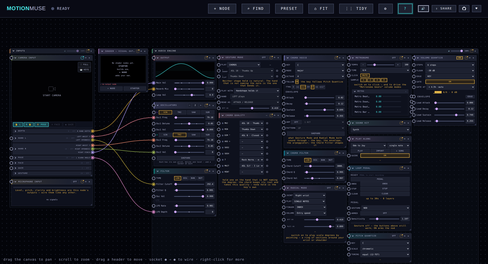

# MotionMuse

A browser-based instrument that maps live webcam data — hand position, gesture, and body pose — to audio synthesis parameters in real time. No plugins, no install: pure Web APIs served as static files.

## Demo



<sub>Kept in step with the UI automatically — see [Keeping the screenshot honest](#keeping-the-screenshot-honest). Regenerate by hand with `npm run screenshot`.</sub>

Open `index.html` (or the Netlify deploy) and:
1. Click **START CAMERA** — the blank frame *is* the button — MediaPipe loads and begins detecting hands and pose
2. Click **PRESET** — pick a starting patch (hands, face, gaze or whole-body)
3. Press **Space** (or click the amber **🔇** on the camera view) to unmute, then move
   and play — the synthesiser is already running, it just starts silent

## Support

If MotionMuse is useful to you, you can support its development — the **♥**
button in the app header links to:

- [GitHub Sponsors](https://github.com/sponsors/Dentarthurdent42)
- [Ko-fi](https://ko-fi.com/mathieu71673)
- [Buy Me a Coffee](https://buymeacoffee.com/dentarthurdent)

> **Maintainer setup** — to add or change a platform, edit `LINKS` in
> `src/ui/donate.js` (the in-app ♥ popover) and `.github/FUNDING.yml` (GitHub's
> Sponsor button). Both are plain lists of name → URL; the popover sizes itself
> to whatever is in it. GitHub Sponsors additionally requires
> [enrolling](https://github.com/sponsors).

## How it works

```
Webcam → MediaPipe (Hand + Pose) → Signal Bus → Mapper → Web Audio Engine
```

- **Signal Bus** (`src/bus.js`): a central `Map` of named signals (e.g. `hand_L_y`, `pinch_R`, `elbow_L`). Any source can `register` and `update` signals; any consumer can `norm`-alise them to 0–1. Registering with `velocity: true` also creates a `<key>_vel` sibling the bus keeps fed with the rate of change — see [Velocities](#velocities--every-measure-also-reports-how-fast-it-is-changing).
- **Tracking toggles**: **✋ L**, **R ✋**, **🧍 POSE**, **☺ FACE** and **◉ GAZE** — one row of chips inside **Camera Input**, under the picture — switch each model off outright. (They live with that input because what the camera tracks is a property of it, not of the app's header; they are beside the picture rather than on top of it because a control over the frame covers the thing you are watching. Hands and pose can be set before the camera starts; face and gaze wake once there is a stream to run on.) Hand tracking costs roughly twice what pose does and is normally the frame-rate bottleneck, so this is the bluntest lever available. With hands and pose both on the two models alternate frames; with one off, **the other runs every frame** rather than idling on its turn. Left and right are separate for a reason beyond cost: handedness is a **guess**, inferred from the hand's appearance, and a single hand at an odd angle gets mislabelled — silently swapping every signal it drives to the other side's keys. Enabling exactly one side skips the guess entirely (whatever is detected *is* that hand) and drops `numHands` to 1, so the landmark stage runs once. Dev mode's **MODELS** panel adds the pose model size and the `GPU`/`CPU` delegate, which applies to *both* models.
- **CV Source** (`src/cv.js`): runs MediaPipe `HandLandmarker` plus a swappable **pose backend** (`src/posebackends.js` — MediaPipe lite/full/heavy or TF.js MoveNet), extracts ~30 signals per frame, and writes them into the bus. Hand and pose inference **alternate frames** (each still ≥15 Hz at a 30 fps camera) so per-frame cost stays half of running both, and every positional signal passes through a per-signal **One-Euro filter** (`src/filter.js`, applied in `bus.update`) — the standard low-latency jitter filter: heavy smoothing on a held pose, light smoothing on fast moves.
- **Mapper** (`src/mapper.js`): each mapping takes one signal, applies a curve (linear, quad, cubic, log, sqrt, invert, invert+ease), scales it to an output range, and writes it to an audio parameter on every RAF tick. It's presented as a **node graph** (`src/ui/mapper-ui.js`) à la Blender geometry nodes / UE Blueprints: **input** signal nodes on the left, **output** parameter nodes on the right, joined by colour-coded bezier **cables**. Crucially each input is a single node whose one output socket **fans out** — reuse a signal by wiring it to as many parameters as you like; each parameter takes one incoming cable. Drag between two nodes to connect (or tap one, then the other) — the whole pill is a drag handle, sockets carry an oversized invisible tap target, and a release lands on the nearest eligible socket within a fingertip's radius, so wiring works with a thumb and not just a mouse. A cable's width/opacity pulses with its live value, and **each node carries its own level bar** along the bottom edge (see *Two bars, two different numbers* below); range and curve stay hidden until you click a cable, and hovering a cable highlights it while dimming the rest, so wires stay easy to follow. Any cable can also be **inverted** with its `⇅ INVERT` toggle — the input's high end then drives the output's low end, which composes with (rather than replaces) the curve, so any response shape can run either way round. A cable can also be **quantised into N discrete levels** with its `steps` field (applied after the curve, so pair it with `log`/`quad` for perceptual spacing) — a stepped filter cutoff gives you a handful of definite timbres instead of a continuous smear. The **+ add input…** and **+ add output…** pickers keep their choices grouped by category (signal group / parameter section) rather than one flat list. Nodes stay put once placed: deleting a cable (its × in the editor) leaves both endpoint nodes on the canvas to be re-wired. An output also *remembers* its range, curve, steps and invert flag, so re-wiring a different input into it (or unplugging and re-plugging) doesn't reset them. Each node has its own × — placed on the pill's *outer* edge, opposite its socket, so a fat finger can't hit both — to remove it outright, so even a lone input/output pair can be disconnected or cleared. For **oscillator-frequency** cables the range editor grows a tone picker: a labeled piano keyboard, QWERTY playing (`A W S E D F T G Y H U J` = C…B, `Z`/`X` shift octave) while the editor is open, **−**/**+** semitone nudges, and min/max fields that accept note names (`A4`, `Db3`) as well as Hz — every pick is auditioned through the one-shot voice. **SET MIN** / **SET MAX** choose which endpoint the next pick sets, and the choice *stays put*: keep tapping or nudging to correct MIN until you explicitly press SET MAX. On narrow screens the keyboard renders wider than the panel and scrolls horizontally, so individual keys stay big enough to tap (a horizontal drag pans instead of picking).
- **Audio Engine** (`src/engine.js`): a **resizable oscillator bank** — one oscillator by default, up to eight, each with its own frequency, detune, waveform and **level** (`oscN_freq` / `oscN_detune` / `oscN_volume`) — through a BiquadFilter, and the chord-mode voice bank through a **second, independent filter and level** (`chord_filter_freq` / `chord_filter_q` / `chord_volume`, with `osc_volume` as the whole bank's level, the lead's counterpart to `chord_volume`). The two sources converge into a shared convolution reverb and main gain. All driven by the Web Audio API with 25 ms parameter smoothing. **Volume is the exception**: it snaps onto a perceptual step ladder and fires *one* envelope per level change instead of re-smoothing every frame — see Volume quantisation below. Sliders carry **magnetic snap points** at musically meaningful values (½ volume, centre detune, unity Q…) marked by tick notches — drag near one and the thumb detents onto it; signal-driven (mapped) values are never snapped.
- **Scale quantiser** (`src/scale.js`): optionally snaps oscillator frequencies onto a musical scale, root and tuning system before they reach the engine.
- **Dynamics** (`src/dynamics.js`): the volume step ladder — equal-loudness (dB) levels, an exact-silence bottom rung, and the sticky rounding that keeps a jittery hand from chattering between levels.

## Starting muted

The synthesiser **starts with the page**, so every control in the audio panel is
live from the first paint — you can build a patch, set ranges and audition
nothing until you want to. The output is **muted on launch**, because a page
that makes noise at you before you've asked is hostile on a phone, in a shared
room, and most of all to someone who came to read about it.

Muted is shown three ways, because a silent instrument and a broken one look
identical otherwise:

- the mute button on the camera view turns amber (muted is a *state*, not a
  disabled control);
- a **MUTED** banner sits over the visualiser;
- the waveform **keeps moving** behind that banner. The mute gain is placed
  *after* the analyser precisely so it does — you can see the instrument
  responding to your hands while it is silent.

Three ways to toggle it: the header button, **tapping the visualiser** (the
biggest thing on screen already showing the state), and **Spacebar**. The key
binding is shown, and changed, under **Mute Hotkey** in the audio panel: click
it, press the key you want, Esc cancels.

### The iPhone Ring/Silent switch

Reported as the instrument being completely silent on an iPhone, while a
screen recording of that same session had sound in it — which makes it look
like a phone bug and is in fact ours.

iOS gives every page an **audio session category**, and WebKit picks it from
what the page plays rather than from anything the page asks for. Web Audio on
its own gets **ambient**: the category for incidental noise — a game's bleeps,
a video autoplaying in a feed — and ambient obeys the Ring/Silent switch. A
page playing a media element with a real, unmuted audio track gets
**playback**, the category for something a person came here to listen to, and
playback ignores the switch. MotionMuse is Web Audio end to end and had no
media element, so the switch silenced all of it. The recording still had audio
because a screen recorder taps app audio upstream of the category.

The fix is the door WebKit leaves open: while the instrument is audible, keep
a silent, looping, **unmuted** audio element playing. Two things about it are
easy to get backwards, and both are pinned by tests:

- **Silence has to come from the file, not the element.** A `muted` element —
  or one at volume 0 — does not count as playing audio, so it leaves the page
  in ambient and changes nothing. What loops is half a second of digital
  silence at full volume, built in `src/audiosession.js` rather than shipped
  as an asset so a reader can check the header against the WAV spec. It is
  16-bit specifically: 16-bit PCM silence is 0, so an untouched buffer is
  already silent, where 8-bit silence is 128 and an all-zero buffer would be
  full-scale DC — a click on every loop.
- **It is held only while unmuted, and only on iOS.** A page in the playback
  category stops whatever the phone was already playing, so taking someone's
  music the moment they open a page that is not making a sound yet would be a
  worse bug than the one being fixed. Off iOS it is never created at all:
  Android would lose audio focus for nothing and the desktop would raise media
  keys for a track that does not exist, and neither platform has the switch.

iPadOS needs it too and is the awkward case — it reports itself as `MacIntel`
and keeps "iPad" out of the agent string. A Mac with a touchscreen does not
exist, which is what makes `maxTouchPoints` the tiebreak.

Two details worth knowing about the spacebar in particular. It's the key
browsers use to activate whatever has focus, so the app claims it — a focused
button keeps **Enter** but loses Space, which is the trade that makes the
shortcut behave the same way regardless of invisible focus state. And it is
never intercepted while you're typing in a field or working a `<select>`.

Mute state is deliberately **not remembered** between visits: "you unmuted last
time" isn't consent to make noise now, and it's one keypress to change.

Because the page builds an `AudioContext` without a user gesture, browsers hand
it back **suspended** — the graph exists and every control works, but the clock
is frozen until you interact. The first click, key or tap resumes it. The
gotcha, which cost one shipped bug: `AudioContext.resume()` does not *reject*
when permission is being withheld, it returns a promise that never settles, so
awaiting it before rendering leaves the audio panel permanently empty on every
browser that enforces the policy — and headless Chromium doesn't, so it passes
CI. `npm run test:launch` now forces the suspension and fails if that returns.

## Themes

Five: **Midnight** (default), **High Contrast**, **Ember** — dark; **Paper**
and **Sepia** — light. Picked in the audio panel, persisted, and applied before
first paint so there's no flash of the wrong palette.

Themes are pure CSS. Each is a `[data-theme]` block overriding the same colour
tokens; nothing else in the stylesheet knows a theme exists. The light themes
are not the dark palette inverted — an accent tuned to read on near-black is
invisible on near-white, so every accent is re-chosen rather than reused.

`npm run test:contrast` parses **every** theme's block and checks all of them:
75 pairs across 5 themes, worst 5.10:1 against a 4.5:1 threshold. Checking only
`:root` would have verified the default palette and let the other four ship
unreadable, which is exactly the trap a light theme sets.

## The oscillator bank

The **Oscillators** panel starts with **one** oscillator and a `− n +` stepper to
add more, up to eight. Each one gets a row of waveform buttons, a colour that
matches its marker on the pitch-quantise keyboard, and its **own level** —
`Osc1 Vol`, `Osc2 Vol`, … under Parameters, mappable from the patchbay like
anything else.

This replaced a fixed pair of oscillators balanced by a single `Osc Mix 1↔2`
crossfade. One oscillator was not expressible with that arrangement (the mix
could lean but the second voice was always in the graph) and three were
impossible. Per-oscillator level is a superset: mix *m* was exactly osc1 at
`1-m` and osc2 at `m`, which is how saved presets are migrated on load rather
than dropped.

The stepper goes down to **zero**. Gesture mode has its own voice bank, filter,
level and envelope, so it is a complete instrument on its own, and leaving a
lead oscillator running underneath it is a drone nobody asked for. With an empty
bank the Oscillators rows and every `oscN_*` slider disappear — and so does the
Oscillators group in the patchbay's output picker, since both read the same
table. Starting Play Along puts one oscillator back, because the game scores the
pitch of oscillator 1 and cannot judge anything without it.

Gesture mode's chords are voiced well below the lead on purpose — they were always a bed
beneath it — so **Chord Vol** now runs to 4 rather than 1. At unity, chords
alone measure about −31 dBFS against a unity lead's −6; the extra 12 dB puts
chord-only play at roughly −17 dBFS, a healthy standalone level. It is
deliberately *not* enough to match the lead exactly, which would need a ceiling
near 16 and would squash unity into the bottom 6% of the slider. The default is
unchanged and 1 is a detent.

Two behaviours worth knowing:

- **Added oscillators arrive at half level.** Everything downstream — the volume
  ladder's headroom, the reverb send, the main-gain default — is tuned around one
  voice at unity, and two unity sawtooths into that clip.
- **A patch grows the bank to fit it.** Mapping presets are voiced for up to two
  oscillators, so applying one resizes the bank rather than silently discarding
  the cables it can't host. Loading a *smaller* patch never shrinks the bank —
  that would delete slots you added. Shrinking by hand does prune the cables
  that pointed at the removed slots, since a mapping to a parameter that no
  longer exists is a patchbay node with nothing behind it. **Sound kits are not
  patches** and never resize anything — see below.

A slot's values and waveform survive its removal, so shrinking to hear one voice
and growing back returns the sound you had instead of resetting the slot you were
part-way through dialling in.

The **Parameters** section groups its sliders under the same headings the
patchbay's output picker uses, from the same table — so a parameter is in the
same place whichever way you go looking for it, and the two cannot drift apart.

## First run: pick a starting point

A fresh install opened as one oscillator at 220 Hz with nothing wired to it —
unmute and you get a static sine. That is not a starting point, it is the
absence of one, and it made the first thirty seconds a hunt for where the
instrument was.

The first visit now asks, and it separates the **two ways of playing** — they are
different instruments, not variations of one, and the split is what tells the
guided tour which tour to give you:

**Oscillator** — signals drive pitch and tone. Every mapping preset (**Hands**,
the two **Face** patches, **Gaze**, **Pose**), plus **Blank**, which sits here
because building from nothing means the patchbay.

**Play in a key** — a handshape or a radial ring names a degree. Listed first:
these are the entries that play music the moment you move.

The in-key entries are **two choices crossed**, stated as four cards — *what
names a degree* (a handshape, or pointing at a section of the radial ring) ×
*what it sounds* (the whole chord, or the one note) — and every one of the
four starts in **Shepard tones**, explicitly: it is the in-key modes' default
voice, and a default that depends on what the last setup left switched on is
not a default.

In full:

- **Handshapes · Chords** — handshapes play chords in a key, no wiring. No lead
  oscillator, since a drone under the chords is not what anyone picked this for.
  (It used to switch **DEV** on too, because gesture mode was dev-gated. It is not
  any more — see Developer mode.)
- **Handshapes · Single Notes** — the same seven shapes and the same key,
  sounding one note each, with your other hand sharpening or flattening it. It
  is gesture mode in **note voicing** rather than a second mode, so it shares
  every setting; it is offered here because *"I want to play a melody"* is a
  different intention from *"I want to comp"*, and arriving with the first one
  should not mean picking the second and then finding the switch that undoes
  it. Each choice **states** its voicing rather than inheriting whatever was
  set last.
- **Radial Mode · Single Notes** and **Radial Mode · Chords** — a ring of the
  key's degrees worn on the wrist, played by pointing the index finger (see
  [Radial mode](#radial-mode-play-by-pointing)). Both hands tracked — one
  wears the ring, the other bends notes — plus pose, which carries the
  forearm the ring rides.
- **Blank** — nothing wired, no trackers, and **no oscillator**. Genuinely
  nothing, not a quiet something.

Choosing applies the patch *and* the trackers it needs, saves the session, then
starts the guided tour **for that mode** — two modals at once is not a welcome,
so the tour waits its turn.
Dismissing with Escape is the same as choosing Blank: a fresh app has nothing
wired anyway, so the state after Escape is one of the listed options rather than
a seventh, undescribed one. The question is asked once and never again.

Automation never sees it, for the same reason it never sees the tour: every
headless suite starts with empty storage and a modal over the app would break
all of them. `tests/layout` therefore overrides `navigator.webdriver` to
exercise the real path rather than a stand-in for it.

## Share: a QR code of your setup

**Following a link opens straight into the fullscreen camera view.** A link is
an invitation to *play*, not to read a patchbay: someone pointed a phone at a
QR code, and the next thing they should see is themselves, full frame, with
one thing to press. (The CSS fullscreen path, not the native one — a link
lands after a reload with no user gesture anywhere near it, and the native
Fullscreen API rejects anything else.) The tour for the arriving setup then
**waits until you leave fullscreen**: a walkthrough of panels that are behind
a fullscreen camera is a walkthrough of nothing.


**SHARE** (on the camera view, among the picture's own controls) shows a QR
code of everything you have set up. Point a phone at it and the app opens
configured the same way — the point being that handing someone a patch should
not require a file, an account or a server.

**It takes the whole screen.** The code was a 360px card in the middle of the
page, which made sense as a popover and no sense as a thing being read: the
reader is somebody else's camera, across a table or a room, and every pixel of
screen is reach. A code confined to a card is one you have to walk over to.
Full-bleed also removes the app behind it as something to aim at by mistake.
The code takes as much of the sheet as it can while leaving room for the name
and the buttons; everything that is *not* the code keeps a readable measure
rather than stretching across a desktop monitor.

**It is sized in whole modules, in JS, and never by CSS.** Asking CSS for
`width: min(100%, 62dvh)` hands the browser a backing store of one size to
resample into a box of another, and at a fractional ratio the module edges
land between pixels. That is not a "slightly softer" code, it is a coin flip:
scaling the same 121-module code into 350px and 420px boxes decoded, 500px and
558px found no code at all, and turning `image-rendering: pixelated` on or off
changed nothing — both modes failed at exactly the same two sizes. So
`ui/share.js` measures the room the sheet has, asks `drawQR` for the largest
**whole** number of pixels per module that fits, and sets the canvas to
exactly that. Nothing is resampled, and the result is correct by construction
rather than by luck: 363px at 3px/module on a 390px phone, 605px at 5px/module
on a 1440px desktop — against the 300px the old card capped it at.

The sheet's side padding is 8px for the same reason. The code can only grow in
whole steps, so a step of padding is often a whole step of code: at 20px the
phone fell back to 2px per module and a 242px code. A phone's keyboard does not
shrink the layout viewport, so when the name field takes focus the sheet is
moved and resized to `visualViewport` — otherwise its bottom half, buttons
included, would sit behind the keys.

The state is compressed and carried in the URL **fragment**, which is never sent
to a server. There is no server; a shared setup stays between the two people
holding the phones.

What travels is the **instrument**, not the window. Panel widths, section
heights, section order and which column you dragged something to describe the
screen you arranged them on, and pushing a phone's layout onto a laptop is not
"the same settings". The pose-model choice is left behind for the same reason: a
MoveNet variant picked for one machine's GPU is not a recommendation for
someone else's. Theme, dev mode and **which models are running** — hands (each
side separately), pose, face and gaze — do travel, along with every mapping,
gesture, chord assignment and audio parameter. The trackers travel because a
patch wired to `brow_raise` is silent without the face model: handing someone
the mapping without the tracker that feeds it hands them an instrument that
does nothing. The camera is still theirs to start; the trackers come up with it.

**Name it.** A QR code is opaque — a photo of one tells you nothing about the
patch behind it, and a screen showing three is three identical squares. The
SHARE panel offers a line naming the setup ("ambient pads, left hand opens the
filter"), which shows beside the code and travels inside the link, so whoever
opens it is told what they just loaded. It is capped at 80 characters, because
every character is more payload and payload is QR modules — the readout under
the code shows the length, and warns when a setup has grown dense enough to be
worth shortening.

A name also **keeps** it — see [Named configurations](#named-configurations-your-setups).

Opening a shared link applies the state, saves it, and reloads the page without
the fragment. The reload is not laziness — several modules read their state at
import time, so applying afterwards would leave half the app on the old values.

The encoder is `src/qr.js`: byte mode, all 40 versions, four error-correction
levels, no dependencies. Written rather than pulled in because this is a
build-less static PWA that has to work offline, so a CDN script would be a
runtime dependency on a network the user may not have. A hand-written QR encoder
is exactly the kind of code that looks right and is not, so nothing is asserted
about the module pattern: `tests/unit/qr.test.js` encodes, renders to a bitmap
and decodes it with **jsQR**, an independent decoder, then compares the text —
including a 2900-byte version-40 payload and every ECC level. (jsQR is a
devDependency; the app itself ships no dependencies.)

Codes are drawn at error-correction level **L** — the most payload per module,
and the tolerance it gives up, for a torn or dirty code, does not apply to a
picture on a screen being read seconds later. If a setup is too large to fit
any version, the popover says so and offers **COPY LINK**; the link always
works, only the picture of it does not.

**One cell is skipped: version 23 at ECC L.** Walking all 160 version/ECC
combinations through jsQR turned up exactly one that does not survive the round
trip — every mask, every payload length, on a clean 3×-scaled bitmap. The block
layout for that cell agrees with the reader's own table (30 EC codewords over
4×121 + 5×122), so the fault is somewhere not yet found rather than in a number
that can simply be corrected. Until it is understood, `encodeQR` steps over it:
a payload that would land on version 23 at L takes version 24 instead, four
modules wider and scannable. A code nobody can read is worth strictly less than
a slightly larger one, and finding out from a user whose QR does not work is not
a trade worth making. The test sweep pins both the 159 that work and the one
step-over, so this cannot be quietly undone — and if the underlying bug is ever
found, one deleted line restores the cell.

The **oscilloscope** at the top of the audio column is a section like any
other: it folds away with its caret and can be dragged to another column. It
lives *outside* the panel that `renderAudioPanel` rebuilds, because that rebuild
would recreate its canvas and drop the click-to-mute handler with it.

## Sections: containers, scrolling and resizing

Every section — camera view, signals, models, patchbay, gesture mode,
each audio block, the parameter sliders — is its own container: a bordered box
with a header strip, a body that can scroll on its own, and a **grip along the
bottom edge** to set its height. Drag the grip to resize, **double-click it to
fit the content** again. Heights persist per section.

So there are two levels of scrolling, which is the point: long lists (signals,
gestures, output sliders) scroll *inside* their section, and the sections
themselves scroll within their column. Pin the ones you're working with to the
size you want and page through the rest.

Sections start at their natural height with **no** scrollbar; only open-ended
lists get a default height. Giving every section a scroller by default would
trade one annoyance for a worse one. A section that *is* clipped fades at its
bottom edge, and the fade lifts when you reach the end — a 3px scrollbar is not
an affordance.

**The content height is the ceiling.** Drag past it and the height is released
rather than pinned there: a section taller than its contents is a box of empty
space with its own scrollbar, and pinning it at exactly the content height would
stop it growing the next time its list gained a row — it would just start
hiding it.

In **portrait**, the camera panel is pinned to the top of the page, and
everything inside it is pinned with it. The dev-only **EEG / EMG / MODELS**
sections therefore move *out* of that panel at that width and become its next
sibling — in a single-column stack, exactly where they already appeared —
returning inside it in landscape, where the grid places each panel in an
explicit cell and a stray child would land in whatever cell was free. It is a
DOM move because there is no CSS for "opt out of an ancestor's stickiness":
`position: sticky` pins the element's whole box, and this content's only problem
was which box it was in.

A **drop host is the panel, not its collapsible body.** It was the body, which
made a dropped section a child of the thing the fold button hides: collapse
SIGNALS and a MODELS panel someone had dragged into that column vanished with
it. A section moved into a column is a *neighbour* of that column's content, not
part of it, so it sits beside the body and only the body folds away.

**Drag a section's header to move it** — up and down within its column, or
across into another one. Each column offers a single drop host, outlined while
you drag, and an empty one (the camera column with its dev-only sections
hidden, say) grows a target so it can still be aimed at. Placement moves the
real DOM node, which is what makes one drag mean the same thing in both
orientations: landscape puts the columns in explicit grid cells and portrait
stacks them in source order, so a *stored* position has to name a container,
not a coordinate. Both the host and the position within it are re-applied after
every render, so a move survives the audio panel rebuilding its markup and a
reload. Drag a section back to the column it started in and the override is
dropped rather than pinned.

Each container also carries a **hue drawn from where it is on screen** — column
sets the base, vertical position walks it — so you can aim at a section without
reading its title. It's derived from measured geometry rather than declared per
section, because a hardcoded hue would lie the moment a section moved. It is
decoration only: no state is carried by colour, and the accent's lightness is a
per-theme token, because a stripe tuned for near-black grounds vanishes on
near-white.

This is applied at runtime (`src/ui/sections.js`) rather than baked into a
dozen template strings: each section already had the same shape — a header
followed by content — so a section added next week gets a container, a
scroller and a grip without anyone remembering to add them. `npm run
test:layout` fails the build if a section loses its body, its grip or its id,
if a column stops offering a drop host, if a relocated section drifts back to
its birth column across a render or a reload, or if a section ends up taller
than its own contents.

The collapse caret is **drawn from borders, not typed as a character**. The UI
face is IBM Plex Mono, which has no chevron glyph, so a text caret falls back to
whatever the platform substitutes — a different weight, size and baseline on
every device, which is exactly the legibility problem it kept having.

The camera view resizes with its own handle instead, directly beneath it: it
has to keep an exact 4:3 box or the landmark overlay stops lining up with the
video, so that handle drags vertically but writes a *width* and lets the aspect
ratio set the height.

In **portrait** the camera also **sticks to the top** of the scroll, so you can
still see yourself — and the tracking overlay — while working the patchbay and
audio controls below it. This is an instrument you play by moving in front of a
camera; losing sight of the camera while reaching for a control is backwards.
The handle is there for when the height gets in the way.

## Every slider also takes a typed number

A slider is for *finding* a value; a number is for *knowing* one. "Filter at
3 kHz", "96 BPM", "attack 0.02 s" are values you arrive at once and then want
to set exactly, and hunting for them with a thumb on a 200-pixel track is a
game, not a control. So **every range in the app has a numeric twin** — the
audio parameters, both ADSR banks, the arpeggiator's rate and gate, the
metronome's tempo, the expression ranges, the pedal's sensitivity, a graph
node's own knobs.

Nothing new appears on screen: where a slider already had a **readout**, that
readout *is* the field — the number you were reading is the number you type
into, in the same box, so no layout moves. Where there was none, a compact
field is appended. The twin writes through the slider (it sets the value and
dispatches a real `input` event), so every existing handler runs exactly as
it does for a drag, and nothing had to be rewired to accept typing.

Typing is **exact**. A range's value setter rounds to the slider's step, and
those steps exist for dragging — `(max − min) / 300` on the filter is 53 Hz,
so a typed 5000 would land on 5015.51. The write happens with the step out of
the way, and the field then shows what was actually *taken*, since a slider
with magnetic detents rewrites the value it is handed. A value a cable is
driving keeps updating in the field, except while you are typing into it.

It is applied by watching the DOM (`src/ui/numeric.js`) rather than by each
panel remembering to ask, so a panel that rebuilds its own markup gets its
fields back and a slider added later is typable without anyone thinking about
it. `tests/layout/index.js` checks, in a real browser at every width, that
every slider is paired, that a typed value reaches the parameter exactly, and
that no section starts scrolling because of it.

### Two bars, two different numbers

Every node shows its live strength as a bar along its bottom edge, in the
colour of the cable it belongs to. The two ends deliberately report *different*
quantities:

- An **input** bar is `bus.norm(signal)` — precisely the 0–1 the cable is
  handed. That is the adaptive figure, so an input reads full-scale when *your*
  movement is at its extreme, not when the sensor's theoretical maximum is.
- An **output** bar is what the cable *delivers*, after `curve`, `invert` and
  `steps` have had it.

So on a plain linear cable the two bars agree exactly, and **the gap between
them is the curve, made visible**: on a `quad` cable an input at 0.8 shows an
output at 0.64, and flipping `⇅ INVERT` shows 0.36. You can watch the response
shape you chose actually doing something, which is otherwise only inferable
from the sound.

An output bar is measured against **its cable's own `min`/`max` window**, not
the parameter's full range — a cable narrowed to 200–800 Hz on a cutoff whose
range is 20–20000 would otherwise show a sliver that never visibly moves.
Reversed windows (`min` > `max`, which is the other way to spell INVERT) fall
out of the same arithmetic, since both terms flip sign. An *unwired* output has
no window, so it falls back to the parameter's own range and stays a neutral
grey rather than borrowing a cable colour it doesn't have.

The bar is absolutely positioned and driven by `transform: scaleX()`, never by
width: the cables are drawn from *measured socket positions*, so a bar that
participated in layout would drag every wire on the canvas every frame. The
layout suite asserts exactly that — driving a bar from empty to full must move
no socket. An empty bar also keeps a faint track underneath it, because a bar
pinned at zero and a node with no bar at all look identical, and "quiet" should
not read as "broken".

## Function nodes — the patchbay's interior

The patchbay used to be one hop: signal → cable → parameter. **Function
nodes** are what you get when the middle is allowed to grow — the shader-graph
move, done with the machinery already there. A node is *both ends of the
existing patchbay at once*:

- each **input socket** registers as an engine parameter (`ƒ1 Math · A`,
  under the picker's **GRAPH NODES** category) — so any existing cable can
  drive it, with its full curve / range / steps / invert kit;
- its **output** registers as a bus signal (`ƒ1 Math`, in the **graph**
  group) — so any existing cable can read it onward, into an audio parameter
  or into *another node's* input.

No new cable type, no new picker, no new persistence path: the graph **is**
the patchbay, just allowed to bend back on itself. Add nodes with
**+ add node…**; each live node gets a row in the panel for its own discrete
choices (a Math node's op, an LFO's wave) and its ×, which also takes every
cable attached to it. Values are 0..1 on both sides — the cable's out-range
does the scaling into real units, exactly as it always has.

**A × takes one node, never two.** Pulling a node takes the cables that ran to
it — a cable to nowhere is not a thing — but the node at the *far* end of each
of those cables stays on the board. This was an asymmetry rather than a
policy: deleting an input already kept its outputs, and deleting an output did
not keep its input, so pulling one node quietly took a second one with it, and
the one that vanished uninvited was the one carrying the range and the curve.
A node with no cable is a perfectly good thing to have — it is what
**add an input ↓** produces — so there is no reason for one to be swept up by
a deletion at the other end.

| Node | What it computes |
|---|---|
| **Const** | A knob. The graph's way of writing a number onto any input. |
| **Math** | `a ⊕ b` — add, sub, mul, min, max, avg — clamped into range. |
| **Mix** | Crossfade `a → b` by a third input. Wire an LFO into `mix` and two signals take turns. |
| **Smooth** | A one-pole lag with a real time constant (up to ~2 s), frame-rate independent. |
| **Quantize** | Snap onto N levels (2–16). |
| **Sample & Hold** | Samples `in` on the `gate`'s rising edge, holds until the next one. |
| **LFO** | 0.05–12 Hz (exponential), sine/triangle/square/saw, depth around a still centre. |

Evaluation is control-rate, once per frame, in dependency order — a chain of
nodes settles inside the frame; only the hop *through* a cable is one frame
behind, which at 60 fps sits under the One-Euro smoothing every camera signal
already carries. A **cycle is legal** (feedback is a synthesis tool): the
loop's seam reads last frame's value, which makes it a one-frame delay
rather than a deadlock.

**The metronome is on the bus too** (`metro` group): `metro_beat` and
`metro_downbeat` one-frame pulses, `metro_phase` and `metro_bar` ramps. Wire
`metro_beat` into a Sample & Hold's gate and *any* signal becomes
beat-quantized — the graph's generalisation of the play modes' beat-sampled
volume. Nodes save with presets and travel in shared links; module
`src/graph.js`, driven by `tests/unit/graph.test.js`.

## Starting patches (PRESET)

**PRESET** opens a menu of complete patches rather than loading one silently:

| Patch | Needs | What it does |
|---|---|---|
| **Hands** | camera | Left-hand height = pitch, right = second oscillator, pinch = volume |
| **Face · Brow & Mouth** | camera + FACE | Raise your eyebrows for pitch, open your mouth for volume |
| **Face · Expressive** | camera + FACE | Adds smile → filter, pucker → detune, cheek puff → reverb, head roll → osc mix |
| **Gaze · Look to Play** | camera + FACE + GAZE | Look left/right for pitch, up/down for tone, mouth for volume |
| **Pose · Whole Body** | camera | Stand back: arm height and torso lean drive everything |

Your own named setups sit **above** this table in the menu, under YOUR SETUPS —
see [Named configurations](#named-configurations-your-setups).

Each entry lists what still has to be switched on, and picking one says so again
in the toast — a face patch with the camera off is otherwise just silence with
no explanation. Presets live in `PRESETS` (`src/mapper.js`) as plain data:
`[audioParam, signal, min, max, curve, steps, invert]` rows, so adding one is a
single array entry. A unit test checks every preset references a real parameter
and a real signal, with ranges inside each parameter's bounds, so a renamed
signal can't leave a dead patch in the menu.

## Named configurations (Your setups)

Naming a setup in SHARE keeps it. It appears at the top of the **PRESET** menu
under **YOUR SETUPS**, above the built-in starting patches, and restores the
whole instrument when you pick it. Following a link somebody named keeps it the
same way.

The reasoning is that naming a thing is how people mean to keep it. Someone who
types "ambient pads, left hand opens the filter" has said what this setup *is* —
and before this, they then watched it evaporate the moment they moved a slider.
From the other end it was worse: following a named link handed you somebody's
instrument with no way back to it once you touched anything, short of finding
the QR code again.

- **A configuration is a whole snapshot**, not a patch. A built-in preset is a
  set of cables; this is the instrument — audio graph, gestures, gesture mode,
  shader, kit, theme and which trackers were running. Storing less would make
  "the setup I named" mean something different from "the setup I shared", and
  those are the same act.
- **The name is the identity.** Saving under a name you already used replaces
  that configuration rather than growing a second one with the same label — two
  rows reading "ambient pads" would be a menu that cannot be used. Names are
  cleaned and capped exactly as the shared label is, so a link and the SHARE
  field naming the same thing land on one entry.
- **Committed when the name is finished**, not while it is being typed: on
  blur, on Enter, on COPY LINK, and on closing the panel. Typing "ambient" on
  the way to "ambient pads" is not two configurations.
- **Restored the way a loaded file is** — `preset.applyAll()`, refresh the
  panels, reload if it carries UI keys (theme and tracker state are read at
  startup by the modules that own them). Anything less would bring back only
  part of what you named.
- **Capped at 24**, oldest dropped, with a **×** on each row to forget one. A
  name you have not saved under in months is the one you have stopped using,
  and a menu nobody can scroll is not a feature.
- **Renamable in place** — **✎** on the row turns it into a text field. Enter
  or clicking away commits, Escape abandons the edit (and only the edit: the
  menu behind it is not what the key was aimed at). A rename in a dialog would
  cover the list you are renaming *within*, and the one thing you need while
  choosing a name is the names you have already used. Renaming onto a name
  already in use is refused out loud rather than merged. This is where
  renaming parts company with saving: saving under a used name replaces it
  because you just built the thing you are storing, while renaming onto one
  would destroy a setup you did not touch, to make room for one you only meant
  to relabel. `renameConfig` refuses it too, not just the menu, so no future
  caller can lose a patch by being careless.

**The camera view says which one you are playing.** A patchbay full of cables
does not tell you whether this is "ambient pads" or the thing you made after
it, and in fullscreen the patchbay is not even on screen — so the name sits in
the top-left corner of the frame (`src/ui/cam-badge.js`), out of the middle
where you are. The marker behind it lives beside the setups, in
`motionmuse-current-config`, and *not* in the session snapshot: "you are
currently playing X" is a fact about this browser, and a shared link carrying
it would mean nothing to whoever opened it. It is set when you load one of your
setups or follow a named link, cleared when a built-in patch replaces the whole
instrument, and **not** cleared when you move a slider — you are still playing
your setup, just changed, and a name that vanished on the first knob turn would
be a name nobody trusts.

**A QR code on the camera view was tried, and dropped.** The idea was that a
setup could be handed over by screenshotting the picture, with no dialog in
the way — which raised a question worth answering on its own: how small can a
QR code be and still be read?

**Measured, not guessed.** Render at N device pixels per module, screenshot
the pixels the browser actually painted, and hand them to **jsQR** — an
independent decoder, not our own encoder agreeing with itself. The answer is
**one pixel per module**. The floor is not the module *size* but the
requirement that modules land on **whole** pixels: a code scaled to 1.5×
smears every module edge across two pixels and stops decoding long before a 1×
one does. `tests/unit/qr.test.js` pins that at 1 px/module across a range of
payload sizes and both ECC levels the app uses.

**And the answer was still too big.** The default setup's link is 1328
characters, which at ECC L needs a 121×121-module code — 129px square with the
spec's quiet zone. That is a quarter of the width of a phone's camera panel: a
corner ornament in name only, and there is no shrinking it, because 1 px per
module is where the format bottoms out. A code that size has to be somewhere
it can be the whole point. So it is not on the camera view, and **SHARE takes
the screen instead** (below) — which is a better answer to the original
problem anyway, since the thing being read is somebody else's camera across a
table, and every pixel of screen is reach.

The measurement is kept here rather than deleted because it is the reason the
feature is *not* there. Anyone who proposes putting a code back on the frame
is proposing 129px of it.

The store is `src/saved.js`, in localStorage under `motionmuse-saved-v1`. It
filters what it reads: an entry that is not a named snapshot is dropped rather
than handed to the menu, which would otherwise render `undefined` and apply
nothing when clicked. `tests/unit/saved-configs.test.js` covers the round trip,
the replace-by-name rule, the cap, and what happens to junk in storage;
`tests/unit/saved-rename.test.js` covers renaming, the refusal to rename onto
a name in use, and the "currently playing" marker following a rename.

## Loop pedal

Play a phrase, drop it, and it repeats under you while you play the next one
over the top.

**The pedal is a sharp nod.** A loop pedal is a foot switch because the
player's hands are busy; here the hands *are* the instrument, so the switch had
to be something else the body can do without interrupting a phrase. A nod is
read from **`nose_y_vel`** — a velocity, not a position — and that is what makes
it usable: a head held low is a pose you might hold for a bar, while a head that
moves down *fast* is a deliberate stab nothing about playing produces. The same
distinction rescues the eyebrow option (**BROWS**, `brow_raise_vel`), since
`brow_raise` is a mapped control in two of the shipped presets and triggering on
a *raised* brow would fire every time somebody played a high note.

The default reads a **pose** signal, so the pedal works with just the camera —
no face model needed. Hysteresis plus a 700 ms refractory window means one nod
is one press however many frames it spans, and the return stroke (an equal spike
the other way) is not counted. **SENSITIVITY** sets the bar, and the meter beside
it shows how close the last movement came, so calibrating is watching rather
than guessing.

**The gesture is OFF by default** — press **ON** beside the pedal picker to arm
it. A nod is the pedal precisely because you can do it without interrupting a
phrase, which is also why you do it constantly without meaning anything by it:
agreeing, glancing at your hands, moving to your own beat. Armed on a fresh
install, that recorded loops nobody asked for. The transport **buttons work
from the start** either way, so looping is never out of reach — only out of the
way until you ask for it.

**One press cycles the transport:**

```
empty ──▶ recording ──▶ playing ──▶ overdubbing
                           ▲              │
                           └──────────────┘
```

**STOP**, **UNDO** and **CLEAR** are buttons, deliberately: the motion that
starts a take must never be able to end one.

### What it records, and why

The **audio** — the master bus, exactly as you heard it. Recording your *motion*
instead is tempting, because a loop would then follow a key change; it also
means two layers both driving `hand_L_y` fight over one oscillator, which is not
a loop pedal, it is a race. Audio loops the same way in every mode the app has,
and layering is simply mixing.

- **Each pass is its own buffer**, mixed on demand. Bouncing straight into one
  buffer would halve the bookkeeping and make UNDO impossible — and a looper you
  cannot undo is one where the fourth pass costs you the first three.
- **Overdubs land where you played them.** Recording starts the instant the
  pedal goes down, which is somewhere mid-loop, so the samples are written at
  that phase and wrapped past the end. Dropped in at zero, every overdub would
  slide to the top of the bar and the layers would drift apart.
- **Closing an overdub keeps the phase**, so the loop does not stutter back to
  its top on every pass.
- **30 s and 8 layers**, because this is uncompressed float audio in memory:
  30 s of stereo at 48 kHz is ~11 MB per layer.

### The graph

```
… → main ─┬────────────────→ analyser → mute → out
          └→ loopTap (rec)     ↑
             loopSum (play) ───┘
```

The asymmetry is the design. It records from `main` — the **live** sound only —
and returns into `analyser`, downstream of the tap. A looper that recorded its
own output would layer on every pass whether you asked or not, and then run
away. Returning before the analyser keeps the loop on the visualiser and under
the mute button.

It also means the loop does **not** pass through Main Vol, which is deliberate:
`volume` is a mapped parameter — the Hands preset drives it from your pinch — so
routing playback through it would make a finished loop swell and duck with
whatever your hand is doing now. The loop gets **`loop_volume`** instead, which
is mappable like anything else, so you can duck a finished loop under what you
are playing.

Capture is an **AudioWorklet** (`src/loop-recorder.worklet.js`) so the samples
come straight off the render quantum, with a ScriptProcessor fallback for older
Safari. Both are connected through a zero gain to the destination — not
defensively, but because a node the graph cannot reach from the output is never
pulled, so `process()` is never called and the loop records silence.

`src/looper.js` holds the transport and the buffer arithmetic, `src/pedal.js`
the edge detection; `tests/unit/looper.test.js` and `tests/unit/pedal.test.js`
pin the two things that are easy to get subtly, unlistenably wrong — where an
overdub lands in the bar, and how many times one nod counts as a press.

## Pitch quantisation (scales & tuning)

By default the oscillators glide continuously. The **Pitch Quantize** panel
(top of the Audio Engine column) snaps both oscillator frequencies onto the
nearest note of a chosen **root**, **scale** and **tuning system**, so gestures
play *in key* instead of sliding microtonally.

- **Scales:** chromatic, major, natural/harmonic minor, dorian, phrygian,
  mixolydian, major/minor pentatonic, blues, whole-tone.
- **Tunings:** equal temperament (12-TET), just intonation (5-limit),
  Pythagorean. Tunings are defined as the 12 interval ratios from the root, and
  scales pick which degrees are playable — so any scale renders in any tuning
  (e.g. *C minor, just intonation* or *major pentatonic, Pythagorean*).

While quantisation is on, a **piano keyboard** under the selectors shows the
scale at a glance: in-scale notes are tinted (the root most strongly) and two
coloured dots mark where **osc 1** (purple) and **osc 2** (cyan) are currently
snapped, moving live as you play. The note readout beneath it is colour-matched
to the two dots. The toggle defaults to **OFF** (continuous), so existing
behaviour is unchanged until you opt in. Quantisation is applied centrally in
`engine.set()`, so it affects both signal-driven mappings and manual slider moves.

## Volume quantisation (steps, gate & articulation)

A continuous gesture → volume mapping is almost unplayable, and not for the
reason it looks like. Two things go wrong: the engine re-schedules a 25 ms gain
ramp *every frame*, so loudness never settles — it just glides toward a moving
target — and a hand never lands on exactly zero, so "quiet" is a persistent
low-level tone rather than silence. Together they mean notes can't be separated
or re-attacked.

The **Volume Quantize** panel (under Pitch Quantize) snaps the main gain onto
discrete levels, which is what fixes it *indirectly*: once the value is
quantised, changes become rare events, so the engine can fire **one envelope per
level change** and let it complete. The stepping is the enabler; the completed
envelope is the crisp attack you hear.

- **Levels** are spaced equally in **decibels**, not linear gain — hearing is
  logarithmic, so linear rungs would bunch every audible difference into the top
  of the range. The default 6 steps over −30 dB gives silence, −24, −18, −12,
  −6, 0 dB: exactly 6 dB apart.
- **GATE** makes the bottom level *true* silence (gain exactly 0), which is what
  makes a gap between notes possible at all. The select beside it says **where**
  the gate switches, as a share of full volume (`< 18%` = silent below 18 %).
  `·auto` is the ladder's own midpoint, which is a *derivation* rather than a
  preference: with **2 steps** the midpoint lands at −15 dB, so a linear cable
  flips off at 18 % of its travel when what an on/off control implies is
  halfway. Raise it to move the switch later — at 2 steps the top setting puts
  it at half of full scale. The dead band that stops chatter (2 dB) rides along
  with it, and full volume always opens the gate at every setting.
  The adjustment is deliberately bounded to the span between silence and the
  first audible level, so it can only ever move the gate — never silence levels
  that the slider's notches still advertise. That also means it does most of its
  work at coarse step counts: at the default 6 steps the whole range is
  3.8–5.5 %, because on a finer ladder the gate point *is* a fine detail.
- **PLUCK / KEY / BOW** set the attack and release at a level change. Dropping to
  silence gets its own, slower time so it reads as a damped release rather than a
  chop.
- Levels are **sticky** (hysteresis of ~⅓ of a step), so a shaky hand holding a
  level doesn't chatter between two rungs.
- The volume slider's tick notches show the actual levels, and the panel readout
  shows the live rung (`▁████▁ 5/6 · −6 dB`, or `SILENT`).

The **mapping curve matters** as much as the ladder. `pinch_R` reads 1 when the
fingers are together, so volume has to *fall* as it rises — open hand loud,
pinch muted. Plain `inv` would leave the silence level occupying a mere ~4 % of
finger travel, which is unhittable, so the default preset uses **`invquad`**
(invert then ease), widening it to ~20 %.
The gate sits *after* the reverb send, so closing it cuts the tail too — that's
deliberate: a 1.8 s tail spilling across the gap is the very smear the feature
exists to remove. Quantisation is applied centrally in `engine.set()`, so it
covers both gesture-driven writes and manual slider moves.

Measured with `npm run test:audio` (a noisy control signal that hovers near
closed, like a real hand), before → after:

| | before | after |
|---|---|---|
| gain changes while holding still | 29 | **0** |
| gain changes on a jittery hold | 61 | **0** |
| silence reached | **never** (−41 dB floor) | **233 ms** (true zero) |
| separable notes out of 4 | **0** | **4** |
| attack time | n/a | **33 ms** |

## Sound kits

The **Sound Kit** selector (top of the Audio Engine column) applies instrument
timbre presets — **Synth, Piano, Organ, Trumpet, Strings, Flute, Bass** — built
from custom harmonic waveforms, filter and effect settings on the synth engine
(synthesized approximations, not samples; zero downloads, works offline).
A kit sets where the timbre parameters *rest*; gesture mappings keep modulating
on top. Tweaking any waveform, filter or timbre slider flips the selector to
"Custom".

**A kit changes tone and nothing else.** It used to resize the oscillator bank
and set every level too, so picking "Strings" switched on an oscillator you had
deliberately removed and overwrote the balance you had dialled in. How many
voices you play and how loud each is, is your arrangement; a kit describes the
timbre. Waveforms cycle if the bank is bigger than the kit describes — four
oscillators on a two-voice kit repeat slots 1 and 2, rather than falling back to
a default belonging to no instrument — and with one oscillator you get the kit's
lead wave, which is what the name is really about. Slot 1's waveform also sets
the chord voices' tone, so chords follow the kit without it touching their level
either; a chord-only setup with an empty bank still responds to it. The chosen kit is saved with presets. Kits live in `src/soundkit.js`;
custom waveforms are registered through `engine.defineWave()`.

## Guided tour (in-app tutorial)

Choosing a starting point starts the tour **for that way of playing**, as
spotlight coach-marks over the live UI. The app stays fully clickable during the
tour, so "click it now" actually works. Esc closes, ←/→ navigate; on phones the
card becomes a bottom sheet.

**Every panel explains itself.** Each section header carries a **?** at its right
end that runs just that panel's steps — Volume Quantize tells you what GATE does
without walking you past the camera button and the welcome first. The buttons
appear automatically: `src/ui/sections.js` gives one to any panel that has steps,
the same way it gives every panel a fold caret and a resize grip, so a panel
added later gets its **?** for free and a panel with nothing to say gets none.

The header **?** is no longer "restart the whole tutorial". It keeps the steps
that belong to no panel — the welcome, the camera and sound buttons, saving, the
sign-off — and its "updated" pulse counts only those, rather than promising 23
new steps and then showing nine.

**The tour is scoped to a mode.** One tour covering everything meant a
first-timer who picked gesture mode sat through the patchbay, the cable editor and
the falling-note game before reaching the one panel they were going to use. Each
step declares which way of playing it is about — `modes: ['osc']`,
`modes: ['chords']`, or neither, meaning it is about the app rather than a mode —
and a run shows the shared steps *in place* around the mode-specific ones rather
than appending them. The oscillator tour is 16 steps, the chord tour is 16, and
between them every step is reachable; `npm run test:tutorial` walks both and
fails if any step belongs to no mode at all.

The **?** button gives the tour for what you are *currently* set up for, read
from state rather than remembered from the picker — turn gesture mode on later and
it follows. Choosing a patch from the **PRESET** menu offers the oscillator tour
the same way, once, to anyone who has not seen it.

The tour is built for a project that changes weekly:

- **It's data.** Every step is one entry in `TOUR_STEPS`
  (`src/ui/tutorial.js`) — selector, title, two sentences, plus which `mode` and
  which `section` it belongs to. Adding, moving or retiring a feature means
  editing one array entry; the file header documents the exact workflow.
- **It can't silently rot.** `npm run test:tutorial` (run in CI on every PR)
  boots the app, enables every state steps declare they need, and **fails the
  build if any step points at UI that no longer exists** — or if a step is
  tagged for a panel that does not exist (help written and unreachable), or a
  panel's **?** opens nothing, or a **?** opens more than its own panel's steps. At runtime a stale
  step is skipped gracefully instead — the app never breaks because the tour
  lagged a release.
- **The spotlight follows its target.** The ring tracks the target's rectangle
  on a frame loop while the tour is open, rather than repositioning on `resize`
  and `scroll`. Those two miss the cases that matter: a pinch moves only the
  visual viewport and fires no `resize` at all, and a zoom change reflows
  *after* the resize handler has run, stranding the ring against a layout that
  moved out from under it — the symptom being a spotlight sitting in empty
  space a few hundred pixels from the button it is describing. "The layout
  changed" is not an event, so the ring watches the rect instead. The same pass
  divides by any inherited page `zoom`, since a written length is read in the
  element's own units while `getBoundingClientRect` answers in screen pixels.
  `npm run test:tutorial` measures ring-against-target under browser zoom,
  pinch zoom, page zoom and a silent reflow.
- **Returning users see what's new.** Step ids are tracked per user; when a
  release ships steps you haven't seen, the **?** pulses ("tour updated — 2 new
  steps") instead of making you sit through the whole thing again.
- Steps whose feature needs a particular state (audio on, gesture mode on) simply
  don't show until the app is in it — the tour adapts to what's actually on
  screen.

## Developer mode

Most features are visible by default, but experimental / in-progress ones are
tucked behind the **DEV** toggle in the header (persisted). With dev mode off,
the **EEG/EMG** source tabs, the **◈ LiDAR** depth toggle, the **MODELS** panel,
the inference HUD under the camera, the **Shader** panel, the **🖐 CURSOR** hand
cursor (button, its three ⚙ settings rows, and its hotkey) and the **◭ STAGE**
gesture stage are hidden — a deliberate *progressive-disclosure* choice so
newcomers meet a simpler surface.

The rule is: **anything marked 🚧 under construction lives in DEV**, and nothing
under construction is reachable outside it. That covers the ways in that are not
a button, too — the hand cursor's tick and its bound key are both inert with DEV
off, because hiding a button is not the same as switching a feature off and the
HAND CURSOR setting persists. Features that *run* also stop when DEV goes off:
a live LiDAR session ends, the stage tears down, and armed hand cursors disarm.
An armed hand is one the instrument has lost, and leaving that in place with the
button gone is a hand that stops playing for no reason a player can see. The
underlying setting is left alone — DEV gates reach, it does not overwrite what
the player chose.

**Gesture Mode is not among them any more.** It was, and that was
wrong: gesture mode is a way of playing the instrument rather than an experiment,
and hiding it behind DEV meant the one starting point that needs no wiring at all
was the one nobody could find. Both sections are now visible by default and chord
playback no longer checks the flag.

Lives in `src/devmode.js`; under-construction elements carry a `.uc-feature`
class hidden by CSS unless `<body class="dev">`.

## Shader — visual output

The **Shader** panel sits in the **patchbay** column, not the audio one: it is
driven by signals and mappings, so it belongs beside the wiring that feeds it
rather than among the synth's parameters. It renders a WebGL fragment shader (plasma / warp / bars)
that reacts to the live audio level and two signals you pick (default
`hand_R_x` / `hand_R_y`). It honors `prefers-reduced-motion` (freezes the time
term). `src/shader.js` is the renderer (one program, `u_mode` branch);
`src/ui/shader-ui.js` is the panel. The choice + driving signals save with
presets.

## Accessibility & colour (OKLab)

The palette is defined in **OKLab** (`oklch()` tokens in `css/main.css`).
OKLab's perceptually-uniform lightness makes contrast predictable, so every
text/accent token clears **WCAG AA (≥4.5:1)** on the panel ground — checked in
CI by `tests/contrast/index.js` (which parses `oklch()` and computes real sRGB
luminance). Accessibility is treated as both *perceptual* (contrast, visible
`:focus-visible` rings, `prefers-reduced-motion`) and *conceptual* (a clear
input→output mental model, progressive disclosure via dev mode, plain-language
labels, and icon **plus** text — never icon-only). Toggle controls expose
`aria-pressed`; canvases carry `aria-label`.

## Gesture mode

**Gesture Mode** (formerly *Chord Mode*) is one section holding both halves of
playing by gesture: the instrument on top — key, voicing, expression, the
degree assignments, the arpeggiator and envelope — and the **GESTURE
CONFIGURATIONS** library folded underneath, where a gesture is calibrated,
recorded, renamed and removed. They were two sections once, and each grew
read-only echoes of the other to stay legible (chips on the shape rows
repeating the assignments, calibration state repeated beside the selects).
Merging them retired the echoes: the assignment is stated once, in the rows,
and the library is one fold away. The fold follows the mode until you touch it
— closed while the mode is on, open while it is off, and your own choice wins
from then on.

### Calibrating where you chose, not where it is defined

Every assignment row — the seven degrees and **RELEASE** — carries a **⊙**
beside its picker that calibrates whatever gesture is on that row. The library
is where a gesture is *defined*, but the moment you discover a template is
wrong is the moment a chord does not sound, and that is the row, with the fold
below it very possibly shut. Its countdown reports into a status line that
lives *outside* that fold, since not having to open it is the entire point. A
row with nothing assigned has nothing to calibrate, and says so by being
disabled rather than by failing when pressed.

### Gestures that are not handshapes

Nothing in the recogniser was ever about hands. `templateDistance` is a
weighted RMS over channels normalized to 0–1, and the bus already publishes two
more sets of exactly that: the face model's expression channels and the pose
model's joint angles. So a gesture now declares a **kind** — a named channel
list with its own weights — and **● REC** takes a picker saying which to
record:

| Kind | Read from | Channels |
| --- | --- | --- |
| `hand` | the hand model | 12: finger extension, openness, spread, thumb carry, four thumb-to-fingertip contacts |
| `face` | the face model | 14: brows, mouth, smile, pucker, funnel, tongue, cheeks, head yaw and roll |
| `body` | the pose model | 9: elbow angles, arm raise, shoulder lift and swing, torso tilt |

Two channel groups are deliberately *excluded*. Gaze is not in the face vector
and `head_x`/`head_y`/`shoulder_width` are not in the body vector: a gesture
must not also require that you look where you looked, or stand where you stood,
when you recorded it.

`hand` is the only **sided** kind, because there are two hands and which one is
making the shape is load-bearing — it is what lets one hand drive a cable while
the other names chords (see *Which hand names the chord*). A face or a torso is
singular, so a sideless gesture is held on neither hand and is therefore
available to *either*: `activeOn('L')` answers with it, and so does
`activeOn('R')`, or **NAMED BY: LEFT** would quietly make face gestures
unplayable. A hand gesture on the hand actually asked about still wins, being
the more specific answer to the question.

Two things this had to get right, both pinned in
`tests/unit/gesture-kinds.test.js`:

- **A vector read for one kind is never scored against another kind's
  template.** The arrays are different lengths and mean different things, so a
  face template asked about a hand vector does not return a *wrong* answer — it
  returns a confident one. `matchGesture` filters by kind, and
  `templateSeparation` returns `Infinity` across kinds, because two gestures
  that are never asked at the same time cannot collide however close their
  numbers look.
- **A resting face and no face at all are the same all-zero vector.** The hand
  kind can read presence off its own channels (a hand that leaves frame decays
  to zero on channels that are never zero while it is there), but an
  expression cannot. So `face.js` and `cv.js` report presence explicitly —
  the same way `cv.js` already reports the canned classification — and a
  sideless gesture matches nothing until its model says there is something to
  read. Without that, a recorded neutral expression sits permanently matched
  against a model that is switched off.

A gesture with no `kind` is a hand gesture: every built-in, and every setup
ever saved. Recording that never receives a frame — the face tracker is off,
say — gives up after five seconds and names the tracker you need, rather than
counting down forever.

### Renaming

**✎** on any row renames a gesture. Built-ins are code, so the new name is kept
*beside* the built-in (the same way a recalibrated template is) rather than
edited into it, and `resetNames()` gives the shipped name back. An **ASL gloss
is never touched**: the gloss is what the shape *is* and what the list is
ordered by; the name is only what you call it. So renaming *Open Palm* leaves
`ASL 5 · Whatever You Called It`, in the row, in the pickers, and on the
`gesture_<id>` bus signal, which is re-labelled so the patchbay agrees with the
panel.

### One hand means one hand

Enabling only the left hand used to mean "label whatever hand you find as the
left one", which is why the hand resting in your lap could play the instrument.
That came from asking the model for a single hand — `numHands: 1` caps how many
times the landmark stage runs, so it looked like a saving. It is, but only when
a **second hand is actually in frame**: with one hand up, asking for two costs
exactly the same, because the palm detector finds one hand and the landmark
model runs once. So the cap was confined to precisely the case it got wrong.

Both hands are now landmarked and the one whose handedness matches is used. The
label is a guess, so it is only trusted when the model is sure of it (score
≥ 0.9): a confident match wins, an unsure hand is accepted anyway — that is what
keeps a correctly-shown hand from dropping out on a shaky frame — and a hand the
model is confident belongs to the other side is rejected. That last case is the
bug, and it is the only one where a hand is discarded.
`tests/unit/hand-side.test.js` pins all four.

### One hand is not two hands

Held close to the lens, a single hand can trip the palm detector twice and
survive non-max suppression as **two overlapping detections** — which the
classifier then labels Left and Right, because it is guessing at the same
pixels twice. On screen that is two skeletons intersecting impossibly on one
hand; underneath it is worse. With both sides enabled, one copy was filed
under **L** and the other under **R**, so a single hand drove *both* sides'
signals: the off hand that bends a note sharp, or plays its volume, was the
same hand that named the note.

Duplicates are now rejected before either side is assigned, and the copy the
model is surer of survives — there is no more information to go on, and one
side reading a real hand beats both sides reading the same one.

The measure is the interesting part. Clapped hands sit only about **half a palm
apart at the wrist** (the hand cursor's clap is exactly that pose), so a wrist
test tight enough to catch a duplicate would fuse a clap and stop the wake
gesture firing. Mirrored hands put each index's landmark on opposite sides of
the pair — thumb tip against thumb tip spans a palm and a half — so the rule is
the **mean over all 21 landmarks**, where the two cases sit an order of
magnitude apart: a duplicate scores near zero, a clap near one.
`tests/unit/hand-dupe.test.js` pins both, including that a clap survives.

### A landmark the model cannot see is a guess

MediaPipe scores every **pose** landmark with a `visibility`, and nothing read
it. So a subject too close for the model to find a torso — a face filling the
frame — still published elbow angles, shoulder swings and a torso lean,
computed from landmarks the model had placed by extrapolating off the edge of
the picture. Those readings are not noisy, they are *invented*, and they were
drawn on the overlay as though they had been seen.

Pose landmarks below the floor are now dropped, which every consumer already
treats as absent. Two consequences worth stating:

- **A signal that cannot be computed decays** rather than standing at the last
  value it was invented from. A frozen garbage angle otherwise outlives the
  frame that produced it and keeps driving whatever it is mapped to.
- **Radial mode stops riding a forearm that isn't there.** Its ring is
  oriented by the elbow→wrist segment, so a guessed forearm would swing the
  whole ring; without a visible one it falls back to facing the camera, which
  is exactly what it does with pose switched off.

The MoveNet backend already dropped keypoints below its own score
(`posebackends.js`); this is the same rule applied to the MediaPipe path, which
had been passing everything through. `tests/unit/pose-visibility.test.js`.

**The overlay draws what the instrument resolved** — one hand per side, and the
pose landmarks that survived the gate — rather than the raw model output. The
picture and the signals now come from the same values, so the overlay cannot
show a hand that is not playing anything.

### Presets switch the models they need

Choosing a preset now switches every tracker to what the patch actually uses,
off as well as on: **Face · Brow & Mouth** turns face tracking on and hands,
pose and gaze off. Loading a face patch with hands and pose still running costs
two models' worth of frame budget for cables that do not exist.

What a preset needs is **derived from its own signals**, not declared beside it:
every bus signal knows its group (`hand l`, `pose`, `face`, `gaze`…), so the
trackers fall straight out of the cables and cannot drift from them. Wire a face
signal into a preset and the face model becomes required, because that is what
the word means here.

The camera is the one thing it will not switch on for you — turning someone's
webcam on because they browsed a menu is not a decision the app should make — so
that is all the menu's "needs" line reports now. A preset chosen before the
camera starts has its face/gaze intent remembered and applied when the stream
arrives.

### Two recognizers, arbitrated

Hand tracking runs MediaPipe's **GestureRecognizer** rather than the plain
HandLandmarker. It is not a second model on top: open `gesture_recognizer.task`
and you find `hand_landmarker.task` and `hand_gesture_recognizer.task` side by
side, and the result carries the same landmarks / world landmarks / handedness
fields plus `gestures`. The extra cost is a small classifier head and about
550 KB of download (8.4 MB against 7.8 MB), and in exchange seven shapes are
recognized by a trained model instead of hand-measured templates:
`Closed_Fist`, `Open_Palm`, `Pointing_Up`, `Thumb_Up`, `Thumb_Down`, `Victory`,
`ILoveYou` — mapping to **Fist, Open Palm, Point, Thumbs Up, Thumbs Down, Peace**
and **I Love You**. The last two are new, and ship without templates: they have
never been measured on a hand here, and an invented vector would be a false
match waiting to happen. Record one with ✎ and it gains a template like any
other.

The classifier knows only those seven. The ASL number handshapes, rock horns,
the finger gun and
anything you record still come from the template matcher, and the two are
arbitrated by `resolveGesture` (unit-tested in
`tests/unit/gesture-canned.test.js`):

- The classifier wins a shape it **can** name — that is the point of adopting it.
- A template match it **cannot** name wins instead. ASL 4 is four fingers with
  the thumb folded across the palm; the classifier has no such category, so its
  nearest answer is `Open_Palm`. That is it naming the closest thing it knows,
  not evidence the hand is open, so the template survives.
- Below a confidence of 0.6 it is ignored (MediaPipe's own default is 0.5; this
  is stricter because a wrong confident answer silently steals a pose).
- No hand means no gesture, whatever it last said.

If the recognizer bundle will not load — old cache, blocked host, unsupported
delegate — hand tracking falls back to the plain landmarker and the templates
carry recognition exactly as before. Detection is per-instance at the call
site, so nothing downstream knows which one it got.

The **Gestures** section recognizes hand poses and turns them into discrete
triggers. Sixteen built-in gestures ship ready to use — **closed O, point,
peace, three, four, open palm**, the four **fingertip-touch** numbers,
**thumbs-up**, then **I love you, finger gun** (thumb and index extended, the
ASL **L**), **fist, rock horns** and **thumbs-down** — and **● REC** records
your own: name it, hold the pose during the 3-2-1 countdown, and it's captured
(camera must be running). Any gesture, built-in included, can be removed with
its × (removals persist; **RESTORE BUILT-IN GESTURES** brings the defaults
back).

**One list, in ASL gloss order, gloss first.** Where a handshape *is* an ASL
handshape it already has a name in the language, so that name is what orders
it and what leads its label — "ASL 1 · Point", not "Point · ASL 1", because
the thing you scan a sorted column for should be the thing at the front of the
row.

**Numerals count, letters spell**: 0–10, then ILY, L, S. A plain string sort
would be lexicographic and would seat 10 between 1 and 2 — correct for
strings, wrong for a person counting on their hand. Letters have no numeric
reading, so they sort among themselves and follow the numbers; each half is
ordered the way that half is actually read. Handshapes with no gloss — rock
horns, thumbs-down — are not ASL and are not reordered; they follow, and
recorded shapes stay last in the order you made them.

The number handshapes used to fold away into their own **ASL NUMBERS** group,
on the theory that they were a set you opted into. But that split the library
by an accident of which shapes happen to have descriptive names as well as
glosses: 1, 2, 5 and 10 sat above the fold as Point, Peace, Open Palm and
Thumbs Up, while 0 and 3–9 sat below it. Ordering everything by gloss is what
makes a single list scannable, so the group had nothing left to do.
`tests/unit/gesture-order.test.js` pins the sequence — 10 after 9, the letters
after every number, and the gloss at the front of the label.

Every gesture is also exposed as a mappable bus signal `gesture_<id>`, so a
gesture can drive *any* audio parameter, not just chords.

### The feature vector

Recognition is nearest-template matching over twelve normalized hand features:
five finger extensions, openness, spread, how far the thumb is carried from the
palm, and the four thumb-to-fingertip contacts. The last five exist because the
number handshapes can't be represented without them — ASL 6/7/8/9 differ only in
*which* fingertip touches the thumb, and 2-vs-3 and 4-vs-5 only in whether the
thumb is tucked. Both are palm-normalised, so they don't change with hand size or
distance from the camera, and both are computed from image landmarks like every
other feature (world landmarks are optional in the MediaPipe result, and a
missing contact channel would read as a false touch).

Channels are **weighted**, because they aren't equally informative — measured
across the reference photos, `fingerExt`'s thumb moves over a 0.09 range in
total, so unweighted it would just add noise; the contacts, which carry the
number shapes, get the loudest vote. Each template also declares which channels
**define** its shape (a don't-care mask): where the thumb tip incidentally rests
against a fist's curled fingers varies hand to hand and is not what makes a
fist a fist, so the classics ignore the contact channels entirely, while
ASL 6–9 — which are *about* those contacts — care about all of them. Distance is
a weight-normalized RMS over the cared channels, so ranking stays fair between
7-channel and 12-channel templates.

The threshold is a *rejection* radius, not a separation guarantee: which
gesture wins is decided by nearest neighbour, and the value (0.20) sits at the
measured knee of the operating curve — under a live-hand degradation model
(compressed extensions, frame noise, spurious contacts) 99.6% of classic poses
are recognized and 0.2% misread, while only ~4% of relaxed non-gesture hands
slip under it per frame. `tests/unit/gesture-robust.test.js` drives the real
matcher through that model deterministically, so a template or threshold edit
that would regress live behaviour fails CI. Debounce does the rest — a new pose
must win two frames before it takes over, and a few dropped frames are
tolerated before release, so a borderline reading can't machine-gun gesture mode.

### Calibration

`fist`, `point`, `peace` and `thumbs` are **measured**: MediaPipe run over the
reference photos in `tests/gesture-img/`, features read straight out of
`math.js`. The rest have no reference photo, so they're derived from a small
geometric model built on those same measurements and shipped flagged **`est`** —
good starting points, not ground truth. Hands differ, and 2-vs-3 in particular
depends on where *you* put your thumb.

**CALIBRATE** walks through every estimated shape in turn, prompting for the
pose and recording it from your own hand (⊙ on a row does just that one).
Calibrated templates replace the estimate in place, keeping the gesture's id — so
chord assignments and mappings survive — clear the `est` flag, and save with
presets.

`npm run test:gesture-img` runs the hand pipeline over the reference photos,
asserts each maps to the right gesture, and fails if a template edit pushes any
pair below the separation floor. Add `-- --calibrate` to print the measured
feature vectors, the whole template table and the sorted pairwise distances —
that output is where the measured templates come from. (Needs
`@mediapipe/tasks-vision`, a Chromium, and `hand_landmarker.task` in that folder.)

### Chords by scale degree

**Gesture Mode** maps handshapes to chords **by scale degree in a key**, not by
absolute root. Pick a key once — root, mode, octave — and the panel lists the
chords in it (**I ii iii IV V vi vii°** over a diatonic mode) plus **RELEASE**,
each with a dropdown choosing which handshape plays it and an optional diatonic
**7th**. Changing the key transposes every assignment at once, and every chord
is guaranteed to belong to the key.

The key's mode can also be a **pentatonic**, which offers **five** degrees —
numbered 1–5, since roman numerals mean seven tones — and the panel lists five
rows. A shape assigned to degree 6 or 7 goes **dormant** over a pentatonic
rather than being unassigned: switch back to a 7-note mode and it plays its
chord again. The same rule runs the other way at load, so nothing is repaired
or lost crossing the 7↔5 boundary.

The list is of **chords**, one handshape each, and that is the point. It ran the
other way round — a row per handshape, with a chord dropdown — which let the
same shape be a chord *and* the release. The panel would show that happily and
the tick loop then broke the tie by fiat, so what you saw was not what you
heard. Listing the chords makes the mapping a bijection by construction, and
every writer enforces it: choosing a shape takes it off whatever it was doing,
and the shape that was on that chord **swaps** into the one the newcomer just
left rather than being dropped. Dropping it is the obvious reading of "one
shape, one job" and worse to use — moving Peace from V to ii would silently
leave V unplayable. Saved setups from the old format are repaired on load.

The **7th** belongs to the chord, not to the handshape that plays it, so it
survives unassigning the shape. With **FOLLOW** on (the default) the key comes from Pitch
Quantize, so chords land in the same key the melody snaps to — including the
pentatonics now that degrees generalise to them; it stands down automatically
when quantise is off or its scale is one the degree system genuinely cannot
address (blues, whole-tone, chromatic), whose six-plus degrees stack into
clusters rather than chords.

Qualities and numerals are *derived*, never tabulated: stack every other scale
tone and read the intervals back. Harmonic minor therefore comes out
**i ii° III+ iv V vi° vii°** — leading tone and all — with no special cases.

Holding an assigned gesture sustains its chord; releasing it lets the chord go
(hold-to-sound), shaped by a proper **ADSR** — attack, decay, sustain level and
release, set in the Gesture Mode section. The envelope sits on the shared chord
gain rather than per voice: the whole chord is one note here (the voices are
its intervals), so one envelope is what a player means by "the chord's attack".
Retriggering mid-release starts from the dying value rather than snapping to
zero, so fast chord changes don't click.

### What sounds the chord

**PLAY WITH** picks what actually plays a chord once a handshape has named it:

- **Handshape holds it** (the default) — hold the shape, hear the chord, and a
  **RELEASE** shape stops it. One hand does everything, which means the shape is
  doing two jobs and the release shape a third.
- **Other hand — openness** — two-handed. One hand names the chord, the other's
  openness plays it, and **the chord latches**: the naming hand can relax, drop
  out of frame, or go and pick the next chord while the note keeps sounding.
  Which hand plays is switchable.
- **Eyebrows** — one-handed. The hand names chords with either side; your
  eyebrows play them.
- **Metronome beats** — the clock plays it: the shape held when one of the
  metronome's SAMPLE beats lands is struck then, and only then. See the
  Metronome section; needs it switched on.

**NAMED BY** is which hand a handshape is read from: **EITHER**, **LEFT** or
**RIGHT**.

It exists because the other hand is usually busy. Reported from playing: *"I'm
trying to use my left hand openness to adjust filter, but it keeps getting read
as an open palm gesture."* An open hand held out to drive a cable **is** an
open palm — the recognizer is not wrong, it is just answering a question nobody
asked. Outside the two-handed mode, chord mode scanned both hands, so a hand
doing continuous work could not help also naming chords. Naming one hand is
what frees the other for the patchbay: the shapes it makes are then simply the
shapes a hand makes while it works.

**EITHER** is the default and the behaviour that shipped, so nothing that
worked before changes, and a setup saved without the setting loads as EITHER —
which is exactly what it was doing. In **Other hand — openness** the naming
hand is already decided (it is the one not playing), so the control shows that
and dims rather than offering a second, contradicting opinion — the same
arrangement as RATE dimming under SYNC in the arpeggiator.

and how that signal is read (the two signal modes only):

- **ATTACK / RELEASE** — past a threshold it attacks, below it releases, and the
  ADSR runs. Hysteresis keeps a hand hovering at the threshold from
  machine-gunning the envelope.
- **VOLUME** — the signal *is* the level, continuously. There is no envelope to
  run: you are the envelope.

**OFF AT / FULL AT** map the raw signal onto that travel, and they matter more
than they look. Hand openness does **not** reach 0 with a closed fist — it
bottoms out near 0.38 — so feeding it in raw would mean the quietest thing you
can do is "fairly loud" and silence is physically unreachable. Mapping the range
the signal actually occupies is what puts fully-off somewhere your hand can get
to, and the bottom 12% of the travel then rounds down to true silence so it does
not have to be hit exactly. Eyebrows get their own defaults (a comfortable raise
is about half scale; asking for 1.0 would mean straining). The live meter beside
them shows the raw value and where it lands, because otherwise calibrating the
range is guesswork.

The **RELEASE** row — **open palm** by default — applies to the handshape mode
only, and dims in the others, where the expression signal does the releasing. It
is a setting, not a reservation: pick any shape, or none. Giving it a shape that
was playing a chord takes that shape off the chord, exactly as moving a shape
between two chords does; the default set still puts **IV** on `asl4` so nothing
has to be displaced out of the box. Chords play through a dedicated 4-voice bank with **its own
filter and level** — `Chord Cutoff` / `Chord Q` / `Chord Vol`, plus a **Chord
Filter Type** row — so the chord bed can sit darker or quieter than the lead
(or the other way round) without either touching the other. `Osc Vol` is the
lead's own level on the same footing. Both sources then share the reverb and
**Main Vol**, so the volume ladder and its silence gate still govern
everything — chords obey dynamics and go silent when the gate closes. The LFO
wobbles only the *lead* filter; for movement on the chord bed, map any signal
to `chord_filter_freq` in the patchbay. Custom
gestures, calibration and chord assignments are saved with presets. Logic:
`src/gesture.js` (recognizer), `src/chords.js` (chord construction + `diatonic()`),
`src/chordmode.js` (gesture→chord glue), with the voice bank in
`engine.playChord()` / `releaseChord()`.

### Single notes (the off hand says ♮ / ♯ / ♭)

**PLAY** switches what a handshape sounds: **CHORDS**, or **SINGLE NOTES** — the
degree's own note instead of the chord built on it. It is a *voicing*, not a
second mode: the same shapes, the same key, the same expression and the same
arpeggiator, so switching to notes to play a melody over what you were just
comping costs one select and teaches the app nothing new.

Seven shapes name seven degrees, which leaves the five notes between them out
of reach — so **the hand that is not naming the note says what to do to it**:

| Off hand | Note |
|---|---|
| nothing, or any other shape | **natural** |
| **Thumbs Up** | **sharp** — up a semitone |
| **Thumbs Down** | **flat** — down a semitone |

That is the whole chromatic scale from shapes you already know. Either hand can
name and either can bend — whichever hand is holding a degree shape is the one
naming it. The accidental is read continuously, so a thumb turning over *under*
a note that is already sounding re-attacks it at the new pitch rather than
waiting for you to let go, and a flattened note reads as the flat you played
(**B♭**, not A♯). The live **♮ / ♯ / ♭** beside the switch is lit while an
accidental is recognized, which is what separates "flat" from "flat, and the
camera never saw it".

Both accidental shapes are **settings**, and worth knowing why: they are
recognized by MediaPipe's bundled classifier rather than by a measured
template, and **Thumbs Down has no template at all** — with the canned
classifier off it cannot be recognized until you record one (the **⊙** button
on its row in Gestures). Pick any other shape instead if you would rather. One
shape cannot mean both, but a shape already on a degree *can* also be an
accidental: the two are read from different hands, so they are never asked at
once.

Two things fall out of the voicing being one note. The **7th** buttons go dead
— a single note has no 7th — and the **arpeggiator** run becomes the octaves of
that one note, so `2 OCT` on a single note is an octave trill rather than a
chord figure. And in **other hand — openness** expression the off hand is
already playing the volume, so accidentals stand down there and every note
sounds natural; the panel says so rather than leaving two live-looking pickers
that quietly do nothing. Handshape and eyebrow expression both leave a hand
free.

Logic: `diatonicNote()` / `pitchName()` in `src/chords.js` (pure), voicing and
the hand rule in `src/chordmode.js`.

### Arpeggiator

**ARP** turns the held chord into a run of single notes instead of a block. It
is the *same* chord, named by the same handshape and played by the same
expression — the notes just take turns, so everything above still applies:
FOLLOW still transposes it, the 7th still adds a fourth note to the run, and in
two-handed play the expressing hand still owns the loudness while the arpeggio
owns the rhythm.

There is exactly **one arpeggiator in the instrument** (`src/arpvoice.js`):
Radial Mode carries the same ARP row, driving the same state and the same
step clock, and whichever mode currently owns the chord bank feeds it chords.
Two arpeggiators for two modes that park each other would be redundant on
their face — pattern, octaves and the clock are the instrument's, not one
mode's. In Radial Mode the run works under every volume story: entry-speed
attacks restart the pattern at a velocity-scaled envelope, the signal modes
put the hand on the shared gain over the running notes, and the beat-sampled
mode restarts the run on each SAMPLE strike.

| Control | What it does |
|---|---|
| **ON / OFF** | Replaces the block chord with the run. Off by default; setups saved before it existed load as block chords. |
| **Pattern** | `UP`, `DOWN`, `UP · DOWN`, `DOWN · UP`, `RANDOM`. |
| **Octaves** | 1–3. Two octaves over a seventh chord is an eight-note run. |
| **RATE** | Notes per second (0.5–24). The readout gives the tempo equivalent, reading steps as eighth notes. |
| **GATE** | How long each note is **held**, in steps (0.05–3, default 0.9). Below 1 is staccato inside the step, 1 runs the notes wall-to-wall, and above 1 each note is still held while the ones after it start. |
| **SUS** | How long it **rings out after** that, also in steps (0–3, default 0.6) — the tail. |

`UP · DOWN` reflects at the ends rather than concatenating an up-run with a
down-run: over a triad it plays `0 1 2 1`, not `0 1 2 2 1 0`. The naive version
sounds both endpoints twice, which lands as a stumble on every turn.

### Why a gate is not enough

Reported as "the arpeggiator is too staccato by default", and it was — at
*every* setting of every control, which is the part that matters. The engine
cut each arp note dead at its gate with a fade of at most 90 ms, so the run
was a procession of flat-topped blocks however long the blocks were. A gate
can make a note longer; it cannot give it a **shape**, and the difference
between a note that stops and a note that rings is most of what separates an
instrument from a metronome with pitches.

So the note's life is two controls now. GATE is how long it is held; **SUS**
is how long it decays afterwards. Both are in *steps*, so the shape survives a
tempo change: an arpeggio that rings a half-step under the next note keeps
doing that at 2/s and at 20/s.

They share one budget. The engine round-robins four chord voices, so a note
still sounding three steps later would be cut mid-ring by the fourth-next note
reclaiming its voice — which means the cap has to cover the note's *whole*
life, gate plus tail, not each half separately. Turning the gate up therefore
eats into the tail rather than pushing the note past the point where it gets
chopped. The readout reports the tail the notes are **actually** getting, not
the slider's wish, because those differ exactly when a long gate has squeezed
it. `tests/unit/arp.test.js` walks the grid of step, gate and sustain and
holds the budget.

The default moved with it: **gate 0.9, sustain 0.6**, where gate alone used to
be 0.55. A note that stopped just past halfway through its own step is what
"too staccato" was.

### Letting go is not the same as swapping

Reported alongside it: "when releasing a chord that's being sustained, it
should continue sustaining, rather than immediately silencing it."

The arp owns four voices, and it had one way of handing them back — a 30 ms
cut. That is right when *another chord* is taking those voices over, because
anything still ringing would sound underneath the new one. It is wrong when
nothing is taking them: the player let go, and what was ringing should fall
with the chord's own release. Every release path was calling the cut, so
letting go of a chord sounded like switching it off — and once notes had a
sustain tail, the cut was throwing away most of the note.

So there are two of them now. `arpvoice.stop()` is the hard stop and belongs
to the arp flip, where the block chord really is taking the voices. `release()`
does the same bookkeeping but drops only the notes that have **not sounded
yet** — they belong to a chord that has ended — and lets the one still ringing
fade over `engine.releaseChordVoices()`. One pass covers both cases because a
voice mid-note is at its peak and falls from there, while a voice holding only
a note that never started is already at zero, so its ramp is silence.

**Rate, gate and sustain are patchbay outputs** (`Arp Rate`, `Arp Gate`,
`Arp Sustain`, under Gesture Mode), which is the point of expressing the rate
as a plain number rather than a tempo: wire a signal to `arp_rate` and your
hand drives how fast the chord churns, the same way it drives the filter.

And when there IS a clock — the metronome — **SYNC** locks the run to it,
which is the **default** (`2/BEAT`, eighth notes). It does two things,
because rate alone is not sync: the steps take their tempo from the clock's
BPM, *and* the run is **phase-locked** — its first step lands on the next
division of the beat rather than wherever the chord happened to be struck.
An arp at exactly the right speed but a semiquaver off the grid still sounds
like two musicians who have not met. Sync applies only while the metronome
is running (RATE dims to say so); with the clock stopped the slider stands
unchanged, and **FREE** opts out of the grid entirely.

Timing comes off the **audio clock**, not the frame loop: each frame looks
120 ms ahead and schedules whatever falls due, so a dropped frame cannot put a
hole in the pulse. A tab left in the background stops `requestAnimationFrame`
entirely — on return the clock resyncs to now rather than firing the minutes of
steps it "owes", which would arrive as one burst of noise.

Notes go out round-robin across the four voices of the same chord bank, so each
note's release tail rings under the next note's attack; with a single voice the
gate would have to shut before the next note could open, which is the
difference between an arpeggio and a stutter. The pattern order, the note pool
and the step clock are pure functions in `src/arp.js` and are unit-tested
without an AudioContext; `src/chordmode.js` owns the clock and calls
`engine.arpNote()`.

## Radial mode (play by pointing)

The **Radial Mode** section (beside Gesture Mode) is a second way of playing
the chord voice bank: a **circle of equal-angle sections** worn on a joint
like a bracelet, one section per **scale degree** of the key. Point into a
section and its degree sounds; five sections over a pentatonic key, seven
over a diatonic one, re-divided the moment the key changes.

The ring is a genuine circle in space, not a shape painted on the screen:
its plane is **perpendicular to a body axis, with that axis the normal
through its centre**, and the overlay draws its orthographic projection — an
ellipse, foreshortened by however much the axis leans out of the image
plane, which is what makes the orientation legible. **JOINT** picks where it
is worn:

- **Wrist** (either hand) — the normal is the **forearm**: the elbow→wrist
  segment of the pose skeleton runs square through the ring's centre, so the
  ring rides the arm and faces wherever it points. The chosen **fingertip is
  the pointer** — the **index by default** (a FINGER select offers the
  others), aimed around the ring by wrist flexion and deviation, the way a
  clock hand sweeps a dial: C sits at twelve and the degrees ascend
  clockwise in the mirrored view. With pose off the ring lies flat to the
  camera instead; still playable, just fixed to the frame rather than to
  you, and the panel says so.
- **Shoulder** (either side) — the normal is the torso's own **chest axis**,
  so the ring lies on the body's plane (leaning when you do) and the whole
  arm is the pointer: arm hanging is the first degree, ascending through
  out-to-that-side to overhead, whichever arm. Straighten the arm in the
  torso's plane to reach the ring; bend the elbow — or point the arm at the
  camera — to retract. Needs pose tracking.

The sections have **radial thickness** — each is an annular sector, not a ray —
and that thickness is what makes sustain a *place* rather than a moment:
reach out from the ring's axis into the ring and the note attacks, stay
anywhere inside the section and it holds under the chord ADSR, draw back
toward the axis and it releases. **How fast the pointer crosses into a
section sets the attack strength** — a stab is loud, a drift is soft (never
silent: a slow entry is a note meant quietly, not a note not meant). Sliding
around inside the ring into the next section re-attacks on the new degree,
measured by the same yardstick, so runs are played by sweeping — and the
circle is closed, so the last degree and the first are neighbours. Every
boundary carries hysteresis — radial and angular — so a pointer resting *on*
an edge holds its note instead of machine-gunning the envelope.

**VOLUME** offers gesture mode's volume story on top of that. **Entry speed**
(the default) is the behaviour above — velocity sets the attack, the chord
ADSR shapes the note. **Other hand — openness** and **Eyebrows** hand
loudness to a *signal* instead, exactly as gesture mode's VOLUME control
does: the signal *is* the level, continuously, and it is also the only
gate. The ring only **names**: the degree you point at **latches**, the
next articulation of the signal sounds it, and while the signal is open the
pitch is frozen — sweeping the pointer (or losing the ring hand entirely)
cannot bend or cut the held note, only the accidental can. Close the signal
and the latch is free again; aim in the silence, and the rearticulation
takes the new aim. The latched section is drawn as an outline in the hand's
colour — a promise, where a fill means sound — and the panel names it.
There is no envelope to run and no entry speed to read in those modes: you
are the envelope. **Metronome beats** hands the articulation to the clock
instead: the section the pointer is on when a SAMPLE beat lands is struck
then, through the chord ADSR — pointing between beats costs nothing, and a
beat that finds the pointer retracted is a rest. See the Metronome section. **OFF AT / FULL AT** map the raw signal onto that travel
with the same measured defaults gesture mode uses (a fist still reads ~0.42
openness, so silence has to be *put* somewhere your hand can reach), the
bottom of the travel rounds down to true silence, and the live meter beside
them shows the raw value and where it lands, because calibrating a range you
cannot see is guesswork. With the other hand playing the volume, accidentals
stand down — asking that hand to also hold a thumb would be asking for a
specific openness, i.e. a specific loudness; eyebrow volume leaves it free.
Voices are only re-pointed when the note actually changes, never per frame —
the same never-settling-glide lesson gesture mode's volume path learned.

All radii are in the joint's **own units** — palm lengths at the wrist, arm
lengths at the shoulder — measured **perpendicular to the ring's axis**, so
nothing changes when you step closer to the camera or hand the instrument to
smaller hands. The band is **a third of the outer radius** (`RING_THICKNESS`),
and the inner edge is *derived* from that rather than written down beside it,
so the two cannot drift apart: the sections are a rim to aim at, not most of
the disc, and reaching them asks for a deliberate bend — roughly 45° off the
forearm on a fully extended finger — rather than a twitch. Section labels are
sized against the band, which is what has to contain them. Two projections keep the picture honest and playable: the
ring's normal is canonicalised to lean toward the camera, so the section
order on screen never mirror-flips as the arm tilts through the image plane,
and it keeps a minimum depth component, so an edge-on ring stays a readable
ellipse instead of collapsing to a line — applied to the maths and the
picture together, so what you see is what is measured.

Three things are deliberately **shared with Gesture Mode** rather than owned
here:

- **The key.** The KEY row edits the *same* root/mode/octave (with the same
  FOLLOW to Pitch Quantize) that gesture mode plays in — nobody plays two
  scales at once, so there is one scale to pick, reachable from either panel,
  and the two rows can never disagree because they render from one state.
- **The voicing.** **PLAY** offers the same choice: **SINGLE NOTES** (the
  default here — pointing reads as melody) or **CHORDS**, the degree's whole
  chord with its 7ths as set in the gesture panel.
- **The accidentals.** In note voicing the hand *not* wearing the menu bends
  the note with the same two shapes (**Thumbs Up** = ♯, **Thumbs Down** = ♭ by
  default — one setting, gesture mode's). A thumb turning over under a held
  note re-attacks it at the new pitch, at the held strength.
- **The 7ths.** In chord voicing a **7THS** row appears, one button per
  section, labelled with the numeral that degree currently sounds — so the
  label says what the toggle did (`V` → `V7`). It writes the same table
  gesture mode's per-chord **7th** buttons do, because a 7th belongs to the
  chord rather than to whatever is playing it. It has to live here as well as
  there: gesture mode's rows are hidden whenever it is switched off, and
  enabling radial mode switches it off, so without this row the ring's
  chords honoured a 7ths table nothing on screen could reach.

**Shepard tones are the default voice** for this mode: enabling the menu
switches the chord bank's SHEPARD on (see Gesture Mode), because a menu that
wraps around a joint pairs naturally with a timbre that wraps around the
octave — runs around the ring climb without ever leaving their register.
Toggling SHEPARD from the radial panel overrules the default for good; the
auto-on never fights a choice you have made.

Only **one** of Radial Mode and Gesture Mode is on at a time — both voice
through the same four chord voices, and two writers on one bank is a race, not
a duet. Enabling either parks the other; both toggles say so by their state.
The parked mode's **controls stay visible**: only what SOUNDS is exclusive,
and setting a mode up before switching to it is half the point of having two —
hiding the place a chord's 7th or the key is set the moment you switch away
made every shared setting unreachable from where you were standing.

The section also carries the **chord ADSR** — the same four sliders gesture
mode has, writing the same envelope, since both modes voice through the same
bank. It shapes entry-speed notes; in the signal-volume modes there is no
envelope to run — you are the envelope.

The ring is drawn on the **camera overlay**, under the skeletons, in the
overlay's own mirrored space, with note-name labels (numerals in chord
voicing) counter-flipped so they read correctly in the mirror. Its contrast
is **self-contained**, for the same reason the skeleton colours are fixed
rather than themed: the ring sits over arbitrary camera content — a cluttered
room, a striped shirt, a face — and legibility over that is not a job for the
palette. Every section carries its own **dark glass scrim**, every edge and
glyph is **haloed** in that dark under light ink, and the active section's
tint (the pointing hand's overlay colour, stronger while sounding) sits on
top of the scrim rather than replacing it. A pointer line, haloed the same
way, makes what the ring is reading visible rather than a guess.
The ring reads **raw landmarks** — no bus, no bus filter — and the number it
leans on hardest is hand z, the noisiest thing MediaPipe produces. So every
value it actually uses is One-Euro filtered: the forearm axis that orients it
(differenced from two pose landmarks, so it carries both joints' jitter into
every section's position), and the pointer's angle, radius, anchor and scale.
The angle is filtered as a **unit vector** and read back with `atan2`, because
an angle wraps — filtering degrees directly would swing a pointer crossing
the seam through the whole circle instead of across it. Boundary hysteresis
backstops the smoothing; neither alone was enough on a live hand. Losing
tracking resets the filters, so a reacquired hand snaps to where it is rather
than gliding in from where it was lost.

The maths — section resolution on the closed circle, boundary hysteresis,
entry-speed → strength, and both ring geometries — is pure and camera-free in
`src/radial.js` (`makeRadialTracker`, `ringBasis`, `wristGeometry`,
`shoulderGeometry`), driven by `tests/unit/radial.test.js`; the panel is
`src/ui/radial-ui.js`; settings save with presets and travel in shared links
like everything else.

## Metronome

A beat clock the whole instrument can see and hear — one clock, three faces:

- **It clicks.** A short blip through the engine's output, accented on the
  downbeat. **MUTE silences the click and nothing else**: the clock keeps
  counting, the picture keeps pulsing, the sampling modes keep sampling — a
  metronome you can hear *or* just watch is two practice tools for the price
  of one. The clicks are scheduled ahead on the audio clock rather than fired
  from whichever frame noticed the beat: a frame is ~16 ms of jitter, which a
  listener hears as a drunk drummer long before a player sees it.
- **It is drawn on the camera view.** One marker per beat of the bar,
  top-centre — the time signature as a picture rather than a fraction. The
  **downbeat is a diamond** where the others are circles, **SAMPLE beats are
  filled** where masked-off beats are hollow, and the current beat swells and
  lights as it lands. Same self-contained contrast as the ring: a scrim band
  and dark halos, owing nothing to the background.
- **The play modes read it.** Gesture mode's PLAY WITH and radial mode's
  VOLUME each offer **“Metronome beats”**: the selection — the handshape held,
  the section pointed at — is sampled **only when a SAMPLE beat lands**, and
  struck then through the chord ADSR. Changing your mind between beats costs
  nothing; the clock is the articulation, the hand only chooses. A sample
  beat that finds no selection is a rest and releases; a **masked-off beat is
  skipped entirely** — it neither strikes nor releases, so lighting beats 1
  and 3 of a four gives you pulses that ring *through* 2 and 4. The **SAMPLE
  row** in the panel is one toggle per beat of the bar, the same row of
  markers the camera strip draws.

**TEMPO** is a slider (30–300 BPM) with **−**/**+** nudge buttons; **TIME**
offers 2/4 through 12/8 — the numerator is what the instrument consumes
(beats per bar, mask length, markers on screen), the denominator names the
note the BPM counts, and compound meters click every division rather than the
dotted pulse: this is a practice clock, not a conductor. Changing the
signature resizes the SAMPLE mask (kept beats keep their setting, new ones
arrive switched on) and restarts the bar at ONE. The clock itself runs on the
frame clock, because everything it gates — handshapes, the ring's pointer —
only changes once per frame anyway. Settings save with presets and travel in
shared links; the module is `src/metronome.js`, the panel
`src/ui/metronome-ui.js`, both driven by `tests/unit/metronome.test.js` plus
beat-mode tests in the radial and chord-expression suites.

## The camera view is the instrument's face

Four things moved onto the picture, because the picture is where your eyes
already are while you play — and, in fullscreen, the only thing on screen at
all:

- **The blank frame IS the start button.** There is nothing to look at before
  the camera runs, so the empty frame is the target: one big **START CAMERA**,
  centred, at any size and in fullscreen alike, where a control in the page
  header would be off-screen entirely. It is a real `<button>`, so the tap
  that requests camera access is a user gesture wherever it happens. Once
  there is a picture that target is gone — covering the view with a button
  would be covering the instrument — and **⏹ STOP** takes its place in the
  strip beside ⛶ FULL.
- **Mute, SHARE, the source link and ♥** sit bottom-left, opposite that
  strip, so neither covers the other and the middle of the frame — where you
  are — stays clear. Small and quiet: they never compete with what they sit
  over. Mute keeps its amber, because muted is a *state*, not a disabled
  control. The ♥ popover opens upward from there, and hangs off the frame
  rather than off the strip — the strip clips its segments to its own rounded
  corners, and would clip the popover with them.

### One system, not eight chips

Everything floating over the picture obeys one set of measurements. It used to
obey none: each control sized itself from whatever was inside it, so an 11px
GitHub glyph, a 9px ♥ and an emoji made three different heights in a single row
and four different widths, and the result read as debris scattered on the
picture rather than as the instrument's controls.

Four tokens, in their own `:root` because they are geometry rather than colour:
`--cam-ctrl-h` (one height), `--cam-icon` (one box every icon is drawn into),
`--cam-inset` (one distance from the edge a thing hugs) and `--cam-radius`.
A labelled control grows sideways only; one with no label is a **square** of
the shared height, which is what stops ♥ from being a sliver beside SHARE.

**A cluster is one object, not a row of chips.** The container (`.cam-bar`)
carries the border, the background and the radius, and 1px gaps let that
background through as hairline dividers between segments. That is not just a
look: a segment hidden with `display: none` — the DEV-only toggles, ⏹ STOP
before a camera is running — collapses without leaving a stray divider, and the
ends stay round without a `:first-child` rule that a hidden sibling would
break. A vertical cluster stretches its segments to the widest, so the stack
has one edge instead of a ragged one.

The **metronome strip** is a readout rather than a control, but it shares the
top edge of the frame with controls, so it reads the same tokens off the frame
and paints its scrim at a control's height, inset and radius — the three things
on that line are one line. It reads the live custom properties rather than
copying the numbers, because fullscreen redefines them.

Fullscreen *is* that redefinition: the same system one size up (26 → 34px tall,
8 → 14px inset), not a second design. `tests/layout/index.js` measures the lot
in both states — one height across every control, squares where there are no
words, one width down the stack, no border on any segment, hairline dividers,
one radius, both strips at the shared inset — because "they all look the same
size" is exactly the claim a stylesheet quietly stops honouring.

What is left in the page header is what belongs to the **tool** rather than
the instrument: settings and the tour. And what the camera *tracks* went the
other way, off the picture and into **Camera Input** beside it (above) — and
specifically *inside* that container, with the picture the toggles apply to.
They had been put in `#cam-extras`, the drop host that sits below the video,
and on a phone that box **leaves the section entirely**: it is moved out to
escape the sticky camera, which pins its whole box, so the toggles rendered
outside the border labelled Camera Input. The drop host still leaves; the
tracker row does not, because it is not a section someone dragged there — it
is part of this input.

**And the controls clear the keyboard.** With the fullscreen keyboard overlay
up, the actions bar was drawn on top of the keys — which are a control surface
you play with your thumbs, so the bar was both in the way and one mis-tap from
muting. `ui/fullscreen.js` publishes the overlay's height as `--fs-kbd-h` and
the bar (and the ♥ popover it opens) rides above it. Published rather than
duplicated: the height is `makeKbdView`'s to decide — 14% of the frame,
floored at 40px — and a second copy of that expression in CSS is a copy that
goes stale. Leaving fullscreen resets it to zero, or the bar would float a
keyboard's height off the bottom of a windowed view.

### Coming back to a backgrounded tab

Reported as the camera view going black after losing and regaining focus —
while the app still read **CV ACTIVE** with values in the signals panel. It
looked alive because the values were *frozen*: the last ones read before the
tab went away.

Both halves are the same fault. A backgrounded tab has its `<video>` paused by
the browser, and on iOS the camera track is often ended outright. Either way
`currentTime` stops advancing — and the inference loop is gated on exactly
that, so it keeps running while feeding the bus nothing. Nothing restarts the
element on the way back in, because `autoplay` already fired once and does not
fire again.

`cvSource.restore()` handles both cases, and the cheap one is not enough on
its own: `play()` revives a merely paused element, but a track the browser
**ended** is gone for good and only a fresh `getUserMedia` brings the camera
back. The models, canvases and loop are untouched — this reattaches a stream
to a pipeline that never stopped, rather than restarting the camera. It is
driven by three events, because they mean different things and a phone does
not always send all of them: `visibilitychange` (tab or app switch), `pageshow`
(back/forward cache) and `focus` (a window that was merely behind another).
With no camera running it does nothing at all — regaining focus must never
start a camera nobody asked for.

## Fullscreen camera view

**⛶ FULL** (below the camera toggles) makes the camera view fullscreen — via
the native Fullscreen API where available, or a CSS takeover on iPhone Safari
(which has no element fullscreen). **🎹 KEYS** overlays the live pitch-quantise
keyboard along the bottom of the view — in the windowed camera panel as well as
in fullscreen, since the notes it shows are the notes the instrument is
quantised to, which is as worth seeing while you are wiring something as while
you are playing it. Its height is published as `--fs-kbd-h` so the controls on
the frame ride above it rather than sitting on the keys, and released the
moment it is switched off. Gesture overlays keep
their alignment at any screen shape.

The CSS takeover is `position: fixed; inset: 0`, and it spent a while losing a
specificity tie. `.panel-cam #video-wrap` — the responsive rule that gives the
camera its width in each orientation — and `#video-wrap.fake-fullscreen` both
weigh one id and one class, and the responsive one is declared later, so it
won: "fullscreen" on a desktop was 400px wide and centred, with the page still
visible either side of it. Portrait hid the bug completely, because `--cam-w`
defaults to `100%` there and 100% of a fixed, `inset: 0` box *is* the
viewport — so the phone looked right and the laptop did not. The responsive
rules now exclude `:not(.fs-active)`, which both fixes it and says why; the
layout suite measures the fullscreen box against the viewport at both widths,
since either one alone would have passed.

## Hand cursor (drive the UI by hand)

> 🚧 **Under construction, so it lives in DEV.** Switch **DEV** on in the header
> and the **🖐 CURSOR** button and its ⚙ settings rows appear. Everything below
> works, but the gesture thresholds are still being fitted across different
> hands, cameras and distances — expect to need a deliberate clap and a
> deliberate pinch. With DEV off nothing here runs at all: not the tick, not the
> hotkey, not the overlay.

Enable **HAND CURSOR** in ⚙ settings and the app itself becomes playable by
hand. With **both hands in view**: **clap** (palms together, fingers up, from
apart), then hold up the hand(s) you want inside the short window that opens — each one becomes an
on-screen cursor and **stops playing the instrument** until you toggle it
back the same way. The other hand keeps playing; this is how you change a
patch mid-performance without touching the machine.

With **only one hand in view** — a tablet held in the other hand, say — a
clap is impossible, so holding that hand up, open, for about a second arms it
on its own. Which case you are in is read from what the camera actually sees,
not from the ✋ L/R toggles: both toggles are normally on, so trusting them
meant a one-handed setup could never arm at all.

The state is always visible: the 🖐 button reads **READY** while enabled and
**ARMED** once a hand is a cursor, an armed cursor is a bright filled ring
while a merely-tracked hand gets a dashed amber one (both drawn over a dark
halo so they read against the camera picture, a white keyboard or a black
panel alike), pinching an unarmed hand says so rather than doing nothing, every tracked hand carries a faint ring
before arming (so "listening" never looks like "off"), a one-time hint names
the clap, and a clap that *almost* qualified is told which condition it
missed ("fingers weren't up", "start with your hands apart") rather than
refused silently. The clap detector is fitted to this app's inference
cadence: hand and pose models alternate frames, so contact is often never
sampled and touching palms merge into one detection — a qualified,
fast-converging pair whose projected contact is imminent therefore counts as
the clap it physically was. While both hands are up, hand inference is
prioritised (3 frames of 4) so the approach is sampled fast enough to see.

- **Pinch = press.** Pinch without moving and it is a tap, however long you
  hold it — travel, not time, is what makes a press a drag (buttons, carets, menu items —
  selects open a floating list, since script can't open the native picker);
  a held pinch drags — sliders, patchbay cables, section headers, resize
  grips, and scrolling inside any section body.
- The cursor is the thumb/index midpoint, One-Euro filtered, with the inner
  portion of the camera frame mapped to the whole screen (**CURSOR REACH**
  in settings sets how much). A ring shows each armed hand; it tightens
  when pinched and a box marks what you're aiming at.
- The **cursor key** (default `C`, rebindable) opens the arming window from
  the keyboard, and is the panic key: one press disarms everything. The
  **🖐 CURSOR** button under the camera does the same by click.
- The pinch gate is not a distance threshold: it demands the OK-sign
  *signature* (index arch collapsed against three tall fingers), two clean
  frames or a confidence EMA, a 400 ms probation for fresh pinches, and a
  motion-blur rule that refuses grips born faster than a hand can honestly
  move. All of it is span-relative, so it works at any distance from the
  camera. The interaction design follows the Barehands project
  (github.com/jaredrhod/barehands), reimplemented natively on this app's
  tracking stack.

While a hand is armed its signals **freeze** — they hold the value they had
rather than updating — so the patchbay and gesture mode never fight the cursor
for it. Freezing rather than reporting the hand *absent* is the whole point:
absence is a tracking failure and the safe answer to it is to fail quiet
(decay, and force pinch to 1, since 0 reads as "hand open" and a volume
mapping would take that as full blast). A borrowed hand is not a failure, and
running it through that path drove the default patch's `pinch_R → volume`
mapping to zero — arming a cursor silenced the whole instrument, chords
included. Now the sound you were making simply holds while you work the UI,
and the gesture matcher keeps the shape it had, so a held chord sustains. Logic:
`src/uicontrol.js` (pure state machines — pinch, clap, selection window —
unit-tested in `tests/unit/uicontrol-*.test.js`); `src/ui/uidriver.js`
(cursor → real UI effects); `src/ui/uicontrol-ui.js` (overlay + arming UI).

### The stage (under construction, DEV)

With **DEV** on, **◭ STAGE** (under the camera) opens the fullscreen
**gesture stage**: a glass control surface over the camera feed where *both*
hands are cursors. A **muse ring** breathes at the bottom — tap it and orbs
bloom in orbit; tap an orb and its panel materializes as a glass card
(**PRESETS**, **SOUND KIT**, **MIXER**, **KEY**), wired straight into the
same apply paths the panels use. Grab a card by its title bar and drag it;
grab it with both hands and stretch to resize; **fling** it off-screen to
close it (the throw needs real speed *and* follow-through); **double-clap**
to sweep the stage clean. The **claw** force-pull: flash your hand open,
make a claw (fingers hooked, pinky out), aim at a distant card — it strains
and glows for two seconds — then **snap** the claw shut and it rips across
the screen into your hand. Model: `src/stage.js` (pure physics, tested in
`tests/unit/stage-physics.test.js`); scene: `src/ui/stage-ui.js`; claw state
machine: `clawStep` in `src/uicontrol.js` (`tests/unit/uicontrol-claw.test.js`).

## Play along (Guitar Hero mode)

The **Play Along** section starts a falling-note game — and there is now a
chart for **every way of playing**, not just the oscillator patch:

- **Pitch charts** (every stored song): notes descend toward a hit line above
  the piano keys, and you *hit* a note by steering osc 1's quantised pitch
  onto the target as it crosses the line — using whatever gesture drives
  `osc1_freq` (a Left-Wrist-Y mapping is added automatically if none exists).
  Starting one turns pitch quantise on in the song's key and restores your
  tuning afterwards.
- **Degree charts** (the generated entries): the piano strip becomes **lanes,
  one per degree of the key**, labeled with their numerals, and you hit a bar
  by *sounding that degree* as it lands — a handshape in Gesture Mode, or
  pointing the ring at that section in Radial Mode. Starting one switches the
  right mode on if it is off, and says so. Octave-agnostic scoring does not
  apply: a lane is exact.

A quiet **guide** melody can be toggled; hits and misses get audio feedback.

**⚄ Generated charts** are procedural: seeded, sized by the difficulty, and
built **in the key the instrument is currently set to** — the shared key both
play modes read — so practising a progression practises *your* key. Melodies
walk the scale (stepwise mostly, chord tones favoured on downbeats, a real
cadence onto the tonic); degree charts follow a functional-harmony walk whose
last two bars are always dominant → tonic, so even a random progression ends
like music. Every press of PLAY is a new chart; best scores still accumulate
per entry per difficulty, because the *skill* is stable even when the chart
is not.

**IMPORT** takes your own **MIDI files** (`.mid`): parsed in the browser — an
own-built SMF reader, `src/midifile.js`, nothing uploaded anywhere — the
busiest non-drum track becomes the melody, stacked notes reduce to the top
voice, timing lands on the beat grid at the file's first tempo, the register
is brought onto the keyboard by whole octaves, and a Krumhansl-style profile
match guesses the key for the quantiser. Imported songs live in
`localStorage` (up to 24; oldest out first), appear under IMPORTED in the
song picker, and leave with **✕ SONG**.

**Scoring:** hits are timing-graded — **PERFECT** inside the central 40% of
the difficulty's window (150 pts, higher chirp, amber flash) vs **GOOD**
(100 pts), both plus a streak bonus of `10 × min(streak, 10)`; floating
PERFECT/GOOD/MISS text rises off the hit line. Songs end on a results screen:
a big **letter grade** from accuracy (S ≥ 95%, A ≥ 90%, B ≥ 75%, C ≥ 60%,
else D), score with a **★ NEW BEST** star when you beat your record, tier
counts and best streak. Best scores persist per song per difficulty in
`localStorage` (`motionmuse-scores` — kept out of shareable preset files);
the panel shows the saved best for the selected song while idle. Quitting
mid-song discards the run.

- **Songs** (public domain, bundled in `src/songs.js`, which also keeps the
  imported registry): Ode to Joy, Twinkle Twinkle, When the Saints,
  Scarborough Fair. Chart format:
  `{ bpm, beatsPerBar, root, scale, notes: [{ b, m, d }] }` — beat, MIDI note,
  duration in beats; degree-chart notes carry `deg` beside the guide-midi `m`.
- **Difficulties:** *easy* (downbeats & long notes only, ±250 ms window,
  slow fall, octave-agnostic matching), *medium* (on-the-beat notes, ±180 ms),
  *hard* (every note, ±120 ms, fast fall).
- The game renders in the panel and — best experience — on the fullscreen
  overlay. Game logic: `src/playalong.js`; renderer: `src/ui/playalong-ui.js`.

## Saving & loading

**SAVE** (in the mapper toolbar) downloads the entire instrument — every
mapping plus all audio parameters, waveform/filter choices, the pitch-quantise
tuning, the volume-step configuration, and everything gesture-side (custom
recordings, hidden built-ins, calibrated templates, the chord key and its degree
assignments) — as a single `.json` file you can keep or share. **LOAD** restores
one. Chord assignments merge over the shipped defaults rather than replacing
them, so gestures added in a later version still arrive with a chord; assignments
saved in the old absolute `root + octave + quality` format migrate to the nearest
degree of the key.
The current session is also stored in `localStorage`, so your setup returns
automatically after a reload or PWA relaunch. Preset files and stored keys were
renamed with the MotionMuse rebrand; files saved under the old name still load,
and existing settings, panel widths and high scores migrate across on first
read (`src/storage.js`). Serialisation lives in
`src/preset.js`; `engine.snapshot()`/`restore()` and `mapper.serialize()`/`load()`
own their respective slices of state.

## Available signals

| Key | Description |
|-----|-------------|
| `hand_L_x` / `hand_R_x` | Wrist X position (0 = left edge) |
| `hand_L_y` / `hand_R_y` | Wrist Y position (0 = bottom, 1 = top) |
| `hand_L_open` / `hand_R_open` | Hand openness (0 = fist, 1 = fully open) |
| `hand_L_spread` / `hand_R_spread` | Thumb-to-pinky spread |
| `pinch_L` / `pinch_R` | Pinch strength — 1 when the thumb and index tips are together, 0 with the hand open. World-space, so camera-independent |
| `finger_L_thumb` … `finger_R_pinky` | Individual finger extension (0–1), measured as the **joint angle** the finger makes rather than its tip-to-base distance — so the same shape reads the same whether your hand is at the lens or at arm's length |
| `thumb_out_L` / `thumb_out_R` | How far the thumb is carried from the palm (0 = folded across it, 1 = clear) |
| `contact_L_index` … `contact_R_pinky` | Thumb-to-fingertip contact (1 = pads touching). Palm-normalised, and tight enough that a merely curled finger doesn't register — a thumb-to-pinky tap makes a clean discrete trigger |
| `elbow_L` / `elbow_R` | Elbow joint angle in degrees — **self-calibrating**: the observed per-user range (nobody's elbow reaches 0° or 180°) maps to the full control range once ≥25° of motion has been seen |
| `shoulder_y_L` / `shoulder_y_R` | Shoulder height |
| `shoulder_elev_L` / `shoulder_elev_R` | How far the arm is **lifted** at the shoulder, in degrees against the torso's own axis: 0° hanging by your side, 90° horizontal, 180° straight overhead. Self-calibrating like the elbows |
| `shoulder_azim_L` / `shoulder_azim_R` | Where the lifted arm **points**, in degrees: 0° straight out to that side, +90° reaching forward, −90° reaching behind, ±180° folded across the chest. Not self-calibrating — its zero means something exact |
| `shoulder_width` | Distance between shoulders |
| `arm_raise_L` / `arm_raise_R` | How far the arm is raised — 0 hanging by your side, 0.5 horizontal, 1 straight overhead. The same measurement as `shoulder_elev_*`, scaled to the 0–1 a mapping range wants |
| `torso_tilt` | Lateral torso lean (−1 = left, +1 = right) |
| `head_x` / `head_y` | Nose position |
| `nose_y` | Raw nose Y (high = head dipped) |
| `hand_L_z` / `hand_R_z` | Hand **distance from camera** (0 = far, 1 = near) |
| `hand_dz` | Depth difference between hands (push one hand forward) |
| `body_z` | Torso distance from camera |
| `depth_near` | Nearest surface in the scene, in metres (LiDAR only) |
| `depth_center` | Depth at frame centre, in metres (LiDAR only) |
| `brow_raise` / `brow_furrow` / `brow_L` / `brow_R` | Eyebrow raise / furrow, per-side outer raise (FACE) |
| `mouth_open` / `smile` / `pucker` / `lips_funnel` | Lip & jaw shapes (FACE) |
| `tongue_out` | Tongue sticking out (FACE) |
| `cheek_puff` / `cheek_squint_L` / `cheek_squint_R` | Cheek shapes (FACE) |
| `ear_L_x/y` / `ear_R_x/y` | Tracked ear positions (FACE) |
| `head_yaw` / `head_roll` | Head orientation derived from the ears, −1..1 (FACE) |
| `gaze_x` / `gaze_y` | Pupil orientation, −1..1, subject's frame (GAZE) |

### Velocities — every measure also reports how fast it is changing

Where a signal says *where something is*, its velocity says *how fast that is
moving*, and the two play like different instruments. A displacement is a
slider you hold; a velocity is a gesture you throw. An eyebrow held raised is a
sustained value — the same eyebrow **flicked** is a transient, and only the
first of those was reachable before.

Every continuous signal in the table above therefore has a sibling **`<key>_vel`**
— `hand_R_open_vel`, `brow_raise_vel`, `mic_level_vel`. For a signal measured in
degrees the twin is an **angular velocity**: `elbow_L_vel` and
`shoulder_azim_R_vel` are degrees per second, and need no separate machinery,
because degrees per second is spans per second like anything else.

They are ordinary bus signals rather than a special case, so everything that
already walks the bus picks them up for free — the patchbay's input picker
(listed beside their measure, labelled `… Δ`), the shader's axis pickers, the
signals panel, saved patches, and `trackersFor()`, which knows a velocity needs
the same model its measure does.

- **Signed.** Which *way* something is moving is half of what it tells you, so
  the range is symmetric about zero: full scale is four spans of the source per
  second in each direction. Wired into a mapping, that puts the parameter
  mid-range at rest and drives it either way — a bipolar control.
- **Self-calibrating.** How fast a given person moves is not something a
  constant can know, and it varies between players far more than displacement
  does, so velocities `adapt` with a low bar to engage.
- **Filtered harder than their source.** Differencing amplifies whatever jitter
  survived the source's own filter, and a velocity that flickers is unusable as
  a control even when it is accurate.
- **Measured against the wall clock**, not per frame, so a dropped frame reports
  a slower move rather than a bigger one. When tracking is lost the velocity
  decays with its measure and forgets when it last sampled — the gap is not a
  slow movement, and differencing across it would read as a violent one.

Signals that are already discrete or already a rate get no twin: gesture
matches and thumb contacts are on/off, `hand_dz` is itself a difference (its
derivative would be an acceleration), and `mic_clarity` reports how much to
trust the pitch, which is a diagnostic rather than something to play.

In the signals panel a measure with a velocity puts its name on its own line
with both channels indented beneath it, each with its own number and bar:

```
L Hand Depth
    DISPLACEMENT   0.72  ▓▓▓▓▓▓▓▓░░░░
    VELOCITY       1.90  ▓▓▓▓▓░░░░░░░
```

The bar column is a fixed width in **every** row of the panel, so any two bars
are read off the same ruler. The velocity bar shows **speed**, filling from
empty in either direction — a signed value drawn straight would sit half-full
while nothing moved — and the number beside it keeps the sign, which is where
the direction belongs. Clicking either channel copies that channel's key;
clicking the measure's name copies the measure's.

## Face & gaze tracking (opt-in)

Two toggles in the camera view's TRACKING strip, disabled until the camera
is running (they load a model onto the live stream, so there has to be one):

- **☺ FACE** loads MediaPipe `FaceLandmarker` (with blendshapes) and publishes
  eyebrow, lip, tongue, cheek and ear signals. Ears don't articulate, so their
  tracked positions are exposed directly plus derived `head_yaw` / `head_roll`.
- **◉ GAZE** publishes pupil orientation as `gaze_x` / `gaze_y` (−1..1, in the
  subject's frame), drawn live as vectors on the iris.

Both are **off by default** and independent; either loads the shared face model
on first use (`src/face.js`, own detection loop and overlay — the hand/pose
pipeline is untouched). All face/gaze signals are registered up front, so they
can be mapped (and saved in presets) before tracking is enabled.

## Resizable panels

On desktop, drag the dividers between the three columns to resize them
(double-click a divider to reset). Widths persist across sessions. A narrow
window squeezes the columns down to fit, but only for display — your chosen
widths are kept and come back when there's room again.

## Desktop sizing

This is a dense, small-text control surface by design — great on a laptop,
cramped on a large monitor. Windows **≥1200px wide** get a deliberately larger
pass: text, paddings, sliders, node-graph sockets, piano keyboards and the
default side-panel widths all scale up together, via a single
`@media (min-width: 1200px)` block in `css/main.css` plus a matching
`src/ui/viewport.js` `isDesktop()` check for the handful of canvases (piano
keyboards, the game highway, the oscilloscope) that draw at a JS-specified
pixel size rather than reading their CSS box. Narrower windows — including the
`max-width: 768px` mobile layout — are completely unaffected.

## Optical depth inputs (LiDAR / ToF)

Out of the box, depth-from-camera is estimated monocularly from MediaPipe
landmarks — apparent hand size and shoulder span. It needs no extra hardware
and works with any webcam, but it is relative and scale-ambiguous.

For **true metric depth**, the `◈ LiDAR` toggle (top-right of the camera view)
opts into the [WebXR Depth Sensing API](https://immersive-web.github.io/depth-sensing/).
**Under construction:** the toggle is hidden unless **DEV** mode is on, and
turning DEV off ends a live depth session; the monocular estimate is always
available regardless. The API exposes the per-pixel depth map produced by an
optical depth sensor —
Apple's **LiDAR** on iOS AR-capable devices, or **ToF** cameras on ARCore
Android. When active, per-landmark depth is sampled directly from the depth map
and transparently replaces the monocular estimate behind the same `*_z` signal
keys, so existing mappings keep working — just more accurately, including in
low-texture and low-light scenes. Two extra metric signals (`depth_near`,
`depth_center`, in metres) are also published.

The toggle is feature-detected: it dims when `immersive-ar` + `depth-sensing`
is unavailable (e.g. desktop browsers, iOS Safari without WebXR), and the app
silently falls back to the monocular estimate. The pluggable backend lives in
`src/depth.js` — additional optical sources (stereo, depth webcams via a
`getUserMedia` depth track) can be added there behind the same signal keys.

## Adding a new signal source

1. In your source module, call `bus.register(key, { label, group, min, max, source })` for each signal in `init()`. Add `velocity: true` for any signal that is a continuous *position* and the bus registers its `<key>_vel` twin and keeps it fed; leave it off for anything discrete or already a rate.
2. Call `bus.update(key, value)` each sample.
3. Call `bus.decay(key)` when the source is absent to fade signals smoothly to zero.

## Project structure

```
index.html          HTML skeleton
css/
  main.css          All styles (CSS variables, layout, components)
src/
  bus.js            Signal registry (adaptive calibration + One-Euro smoothing)
  filter.js         One-Euro low-latency jitter filter
  qr.js             QR encoder (byte mode, no dependencies)
  ui/firstrun.js    First-run starting-point picker
  share.js          Setup <-> shareable link
  saved.js          Named configurations (the setups you kept)
  looper.js         Loop pedal transport + audio capture/playback
  pedal.js          Nod / brow-flick edge detection for the pedal
  loop-recorder.worklet.js  Capture, on the audio thread
  math.js           Geometry helpers (dist3, angles, openness, extension,
                    thumb-out and thumb-to-fingertip contact)
  engine.js         Web Audio API synthesiser
  scale.js          Scale + tuning pitch quantiser
  storage.js        Brand-prefixed localStorage + legacy-key migration
  dynamics.js       Volume step ladder (dB levels, silence gate, hysteresis)
  mapper.js         Signal → audio parameter routing and curves
  preset.js         Save/load of mappings + settings (file + localStorage)
  soundkit.js       Instrument timbre presets (synthesized)
  songs.js          Bundled play-along note charts
  playalong.js      Play-along game logic (scheduler, judging, difficulties)
  chords.js         Chord construction + diatonic degrees (I–vii in any mode),
                    and single notes with an accidental
  arp.js            Arpeggiator pattern order, note pool and step clock (pure)
  gesture.js        Weighted 12-feature gesture recognizer, built-in and ASL
                    templates, calibration store
  chordmode.js      Gesture → scale-degree chord/note mapping (hold-to-sound)
  devmode.js        Developer-mode toggle (gates under-construction features)
  shader.js         WebGL visual-output shader (reacts to audio + signals)
  cv.js             MediaPipe Hand + swappable pose source (dev inference HUD)
  posebackends.js   Pose backends: MediaPipe lite/full/heavy + TF.js MoveNet
  depth.js          Optical depth layer (monocular estimate + WebXR LiDAR/ToF)
  face.js           Opt-in face landmark + gaze tracking (blendshape signals)
  main.js           Event handlers and RAF entry point
  ui/
    status.js       Status dot and toast notifications
    resize.js       Draggable panel splitters (desktop)
    viewport.js     isDesktop() breakpoint check, shared with main.css
    fullscreen.js   Fullscreen camera view + keyboard overlay
    cam-badge.js    Setup name on the frame (+ the DEV-mode QR of it)
    keyboard.js     Shared piano-keyboard renderer
    playalong-ui.js Falling-note highway renderer + game panel
    gesture-ui.js   Gesture Mode panel section (assignments + handshape library)
    shader-ui.js    Shader visual-output panel section
    signals.js      Signal panel (build + live update)
    mapper-ui.js    Mapper rows (render + live bars)
    audio-ui.js     Audio panel (waveform buttons, sliders)
    model-ui.js     Dev-mode pose model comparison panel
    donate.js       Support/donations popover
    preset-menu.js  PRESET button → your saved setups + starting patches
    tutorial.js     Guided tour — TOUR_STEPS data + spotlight engine
    viz.js          Waveform oscilloscope canvas
    hotkeys.js      Keyboard shortcuts (mute, default Space) — rebindable,
                    persisted, and kept clear of typing
scripts/
  mobile-serve.mjs  Local HTTPS server for on-device (phone) testing
  screenshot.mjs    Regenerates docs/screenshot.png (npm run screenshot)
  screenshot-sync.mjs
                    Re-shoots it only when the picture actually changed
                    (npm run screenshot:sync / :check) — see "Keeping the
                    screenshot honest"
  lib/capture.mjs   The one capture recipe both screenshot scripts share
sw.js               Service worker (network-first app shell, cached MediaPipe models)
tests/
  unit/             node --test suites (chords, diatonic degrees, gesture mode,
                    gesture matching + degradation robustness, judging, notes,
                    filter, dynamics, stepped volume, mapper steps, hotkeys)
  contrast/         WCAG contrast checks over the OKLab palette
  gesture-img/      Gesture recognition over reference photos (MediaPipe);
                    --calibrate prints vectors + pairwise template distances
  tutorial/         Tour staleness guard — fails CI if a step targets dead UI
  sw-freshness/     Proves a redeploy is visible on the very next load
  audio-launch/     Engine starts muted and usable against a *suspended*
                    AudioContext — the state real browsers give you and
                    headless Chromium does not
  pose-bench/       Synthetic 3D-mannequin pose-model benchmark
  audio-articulation/  Before/after articulation measurement (settling, gaps, attack)
  ui-ux/
    index.js        Playwright + Claude Vision UI/UX regression harness
    report.js       HTML report generator
```

## Running locally

No build step required. Serve the repo root over HTTP (ES modules require a server, not `file://`):

```bash
npx serve .
# or
python3 -m http.server 8080
```

Then open `http://localhost:8080`.

## Testing on mobile

The camera and the WebXR LiDAR depth path both require a **secure context**, so
a phone can't load the app over `http://<lan-ip>` — it needs HTTPS. Rather than
cutting a Netlify deploy preview for every change, serve the repo straight to
your phone over the local network:

```bash
npm run serve:mobile            # HTTPS on https://<your-lan-ip>:8443
npm run serve:mobile -- 9000    # …or a custom port
```

The script generates a self-signed certificate once (into `.cert/`, gitignored)
covering `localhost` and every LAN address, prints the URLs, and — if
`qrcode-terminal` is installed (`npm i -D qrcode-terminal`) — a scannable QR
code. Connect the phone to the **same Wi-Fi**, open the URL, and accept the
certificate warning once (Android Chrome: *Advanced → proceed*; iOS: install +
trust the profile under *Settings → General → VPN & Device Management*).

Notes:
- **WebXR LiDAR depth** needs **Android Chrome + ARCore**. iOS Safari has no
  WebXR, so on iPhone the `◈ LiDAR` toggle stays dimmed and the app falls back
  to the monocular depth estimate — the camera, hand/pose tracking and all
  other signals still work for on-device testing.
- For a **zero-warning trusted URL** (handy for iOS), tunnel the local server
  instead — e.g. `npx localtunnel --port 8443` or `cloudflared tunnel --url
  https://localhost:8443` — or host the static site on **GitHub Pages** for a
  stable HTTPS URL that scales without per-deploy limits.

## Keeping the screenshot honest

The README's hero image is a picture of software that changes weekly, which is
exactly the kind of thing that rots quietly: nobody notices a screenshot is a
release behind, because it still looks like the app. So it is maintained by a
script rather than by memory.

```bash
npm run screenshot         # force a fresh capture
npm run screenshot:sync    # re-shoot only if the picture actually changed
npm run screenshot:check   # report only — exits 1 if the committed shot is stale
```

`screenshot:sync` runs on a `Stop` hook (`.claude/settings.json`), so a session
that moves the UI cannot end without the shot being brought along.

Two things make that cheap enough to run every time:

**A source hash gates the render.** Hashing `index.html`, `css/`, `src/` and the
capture scripts costs half a second; launching a browser costs seventeen. When
nothing that feeds the picture has moved, the hash matches a memo in the
gitignored `.screenshot-cache` and the script exits immediately.

**A pixel diff gates the write.** A hash match is not the same as a visual
change — most edits under `src/` change nothing you can see, and re-shooting for
those would rewrite a 370 KB binary on every commit. So a hash *miss* only means
a render is worth doing: the fresh capture is compared against the committed one
and the file is replaced only if they genuinely differ. The comparison masks out
the oscilloscope, which draws whatever the analyser holds at the instant of
capture and so never matches between two runs; everything else is deterministic,
and two renders of an unchanged UI differ by exactly zero pixels outside that
box. The threshold is therefore slack, not tolerance: 64 device pixels, well
under anything a person could point at.

The capture itself is the honest first-run state — camera off (there is no
webcam in CI, and a fake device renders a spinning test pattern that would
misrepresent the product), audio started and muted, and the default Hands patch
loaded, which is exactly what one click on **PRESET** does.

One caveat: a capture taken on a machine with different fonts will differ
wholesale from one taken here, so the first sync after cloning onto a new OS
will rewrite the image. That is true of any screenshot generator, and the check
is honest about it rather than papering over it with a large tolerance.

## UI/UX tests

The test suite takes Playwright screenshots across four viewports and evaluates them with Claude Vision:

```bash
npm install
ANTHROPIC_API_KEY=sk-ant-… npm run test:ui
# open test-results/ui-ux-report.html
```

Without `ANTHROPIC_API_KEY` the screenshots are still saved but LLM evaluation is skipped (CI exits 0).

## Inference HUD (dev mode)

The strip of timings across the bottom of the camera view — FPS, HAND, POSE,
FACE, TOTAL, MODEL — is **dev-only**. They are numbers for tuning the vision
pipeline, not something a player needs while performing.

Each row appears only while the model behind it is actually running. HAND and
POSE used to sit there whatever was enabled, so tracking the face alone showed
two averages left over from models that had stopped — indistinguishable from
live ones — and never showed the face model's own cost at all. FACE is measured
on its own loop (`src/face.js`) and reports inference only, not the drawing and
signal extraction around it; TOTAL covers the hand/pose loop, so it goes when
both of those do, and MODEL names the pose backend, so it follows POSE.

## Pose model comparison (dev mode)

With **DEV** on, a **MODELS** panel appears under the camera: pick the pose
backend — **MediaPipe Lite / Full / Heavy** (plus a GPU/CPU delegate switch)
or **TF.js MoveNet Lightning / Thunder** — and watch live detection FPS and
per-model mean/p95 inference times while the camera runs, so variants can be
A/B'd on the actual device. Switches happen live and persist in
`localStorage`. The **DELEGATE** switch applies to *both* the pose and hand
models, and **HANDS** is no longer set here: the camera view's ✋ L / R toggles own it, and the
model is always asked for two hands so the one you enabled can be picked out
from the one you did not (see "One hand means one hand").

MoveNet loads TensorFlow.js lazily (only when selected) and adapts its 17 COCO
keypoints onto the BlazePose indices the pose signals read — all 12 pose
signals survive; hands always stay MediaPipe. It loads the **UMD** builds via
script tags rather than jsdelivr's `+esm` modules: the `+esm` transform of
these CommonJS packages produces cross-package imports that don't resolve
against each other, and the browser rejects the module at link time with
`SyntaxError: Importing binding name '…' is not found`. Backend abstraction:
`src/posebackends.js`; panel: `src/ui/model-ui.js`.

## Pose model benchmark

`npm run test:pose-bench` renders a procedural articulated 3D mannequin
(three.js) through a scripted 300-frame pose timeline — arms up/down, waves,
elbow bends, leans, ending in a 60-frame held T-pose — where every frame's
joint **world transforms are known** and projected to normalized image
coordinates as ground truth. Each backend then runs over the same frames and
is scored on:

- **latency** (mean / p95 wall-clock per frame),
- **accuracy** (per-joint error vs the known transform of each body part —
  mean / median / p95 over nose, shoulders, elbows, wrists, hips),
- **detection rate** (synthetic figures are harder than real people — this is
  a metric, not an assumption), and
- **jitter** (mean frame-to-frame drift of predicted joints while the figure
  holds perfectly still — the ground truth doesn't move at all).

Example run (headless CI container — "GPU" there is SwiftShader software
emulation, so real-GPU latencies will be far lower; error/jitter in
normalized image units ×1000, lower is better):

| backend       | detect % | lat mean | err median | jitter |
|---------------|---------:|---------:|-----------:|-------:|
| mp-lite (CPU) |      100 |    53 ms |        129 |    2.1 |
| mp-lite       |      100 |   315 ms |        129 |    1.8 |
| mp-full       |       86 |   538 ms |         57 |   74.4 |
| mp-heavy      |       92 |  1955 ms |        126 |    3.8 |

Reading it: **full** tracks the figure most tightly (half of lite's median
error) but was the least stable on the synthetic figure (dropouts + drift on
the held pose); **lite** detected every frame with the least jitter at a
fraction of heavy's cost — supporting lite as the shipping default.
MoveNet rows skipped in the sandboxed run (TF.js CDN unreachable there).

Results print as a table and land in `test-results/pose-bench.json`. Guidance:
**lite** for mobile / low-power (lowest latency), **full** when a desktop GPU
can afford ~2× lite's cost for tighter tracking, **heavy** only when accuracy
is critical and latency isn't, MoveNet **Lightning** as the low-latency
alternative if its jitter score wins on your device. Missing `.task` models
are fetched automatically; MoveNet rows skip when the TF.js CDN is
unreachable. Harness: `tests/pose-bench/`.

## Offline caching & getting updates

The service worker is **network-first for the app itself** and cache-first only
for the immutable MediaPipe wasm/model files. That ordering matters more than
it sounds: it was originally cache-first everywhere, which meant a returning
visitor always saw the *previous* deploy — open the site rarely enough and you
could sit several releases behind and reasonably conclude features had been
removed. Now what you load is what's deployed; the cache answers only when the
network fails or takes longer than 3.5 s, which is all the offline/PWA promise
actually needs. `npm run test:sw` proves it: it installs the worker, edits the
served files, reloads once, and fails if the new content doesn't appear (it
also fails if offline loading breaks). It runs in CI.

**Seeing a stale version anyway?** A previously-installed worker from before
this change can still be in charge. Reload once — that fetches the new
`sw.js`, which claims the page and clears the old caches. A private/incognito
tab (no worker, no cache) is the quickest way to confirm what the server is
actually serving.

## Hosting

No build step — serve the repo root as static files over HTTPS.

### Cloudflare Pages (recommended)

1. Go to [pages.cloudflare.com](https://pages.cloudflare.com), connect GitHub, select this repo
2. Build command: *(leave blank)*
3. Publish directory: `.`
4. Deploy — you'll get a free `*.pages.dev` URL

`_redirects` and `_headers` at the repo root are picked up automatically.

### GitHub Pages

Enable GitHub Pages in the repo settings (**Settings → Pages → GitHub Actions**). The included `.github/workflows/deploy.yml` deploys on every push to `main`. The site will be at `https://<user>.github.io/<repo>/`.

Note: GitHub Pages doesn't honour `_headers`, so the service worker is served without `Cache-Control: no-cache`. Chrome re-validates SW files by default regardless, so this is not a practical problem.

### Other static hosts (Render, Surge, etc.)

Serve the repo root. If the host supports Netlify-style redirect files, `_redirects` handles the SPA fallback and the legacy URL redirect automatically.

## Browser requirements

- Chromium 90+, Firefox 90+, Safari 15.4+ (WebGL required for MediaPipe GPU delegate)
- Camera permission required
- HTTPS or `localhost` required (getUserMedia restriction)
